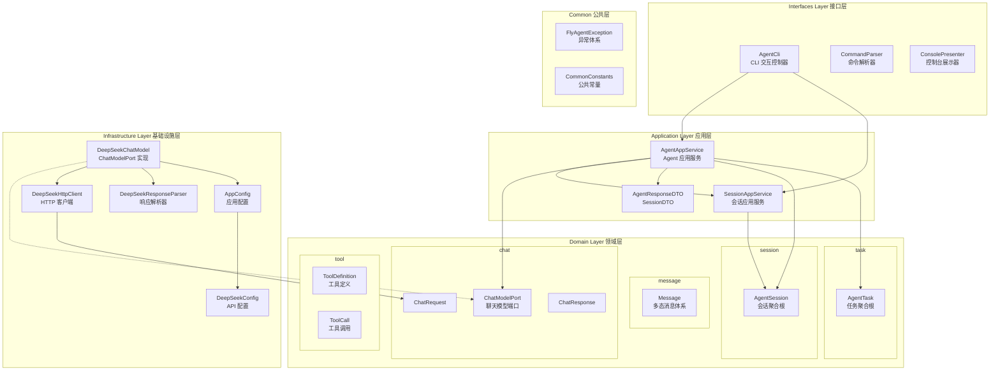
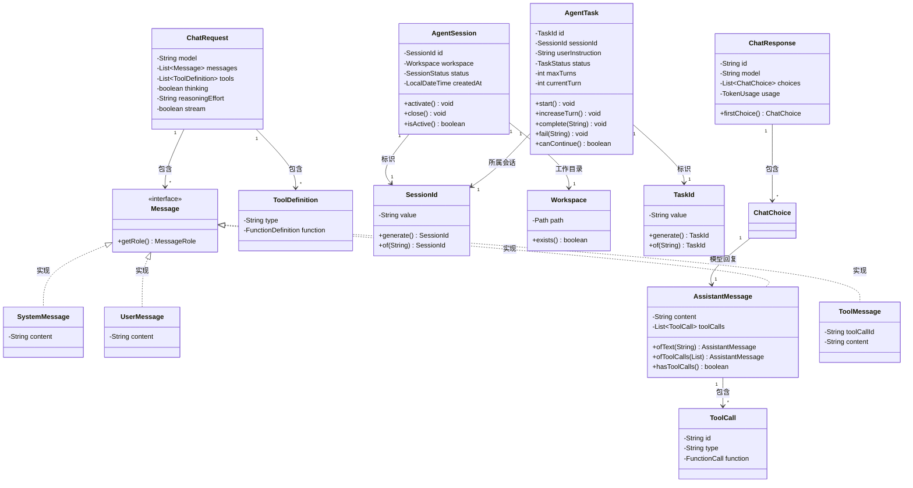
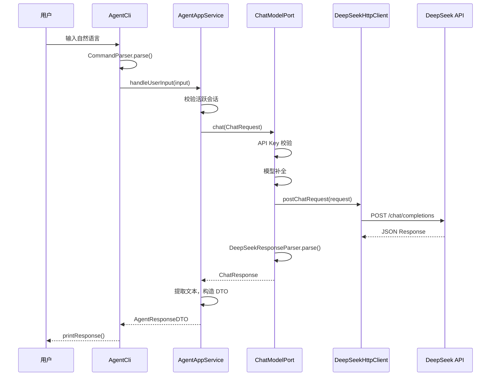
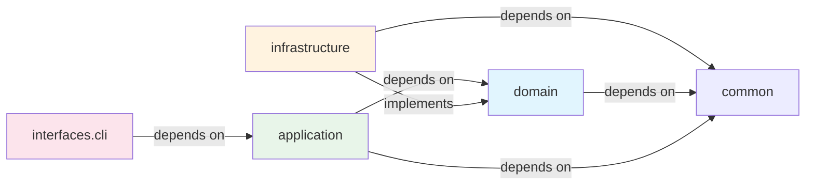
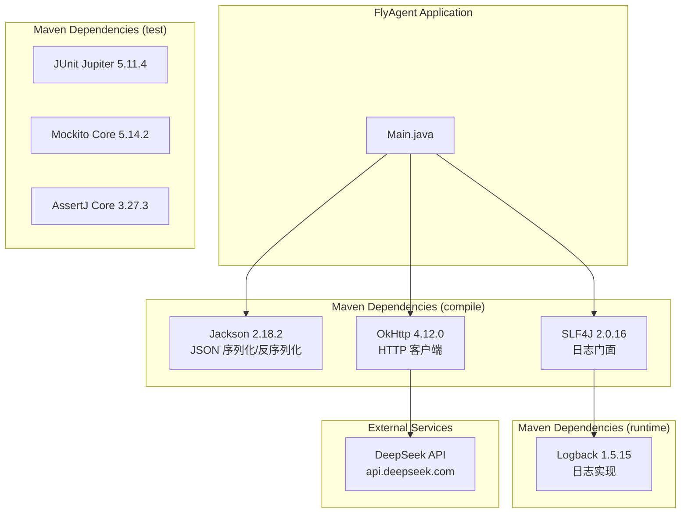
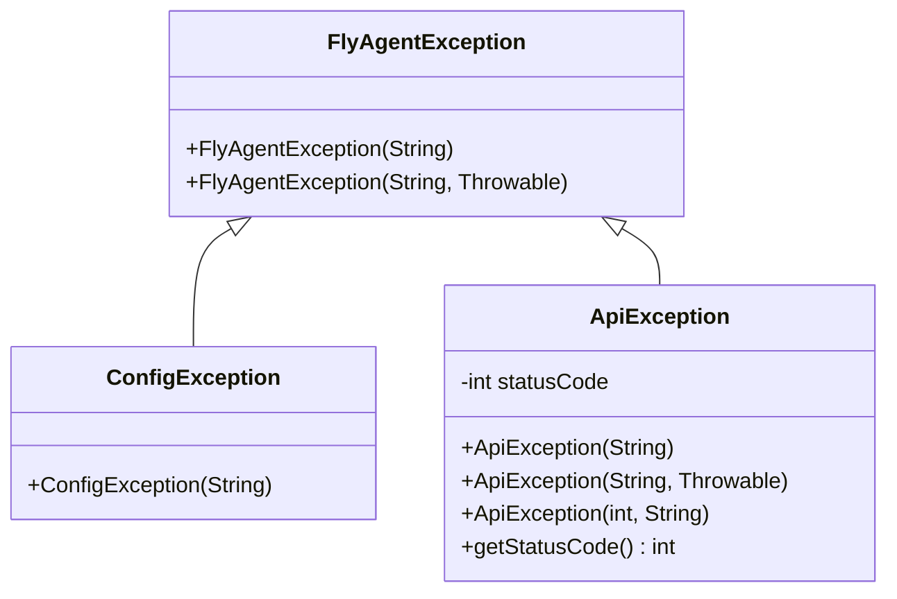
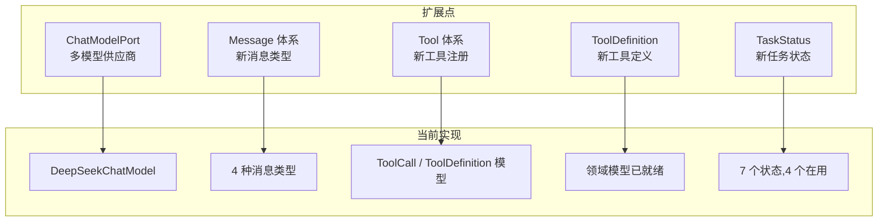
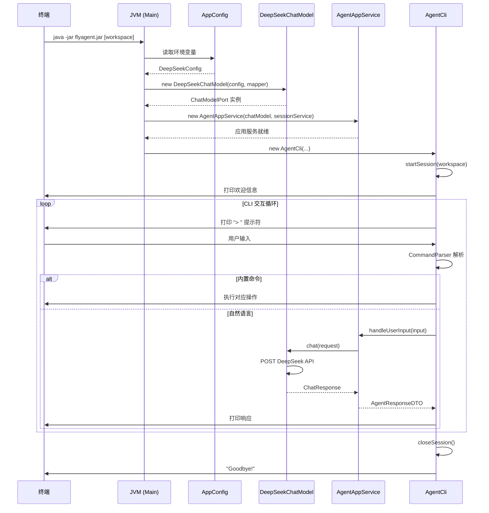

# FlyAgent 系统架构说明文档

> **版本：** 1.0-SNAPSHOT (M1 + M3)  
> **最后更新：** 2026-06-23  
> **作者：** FlyAgent Team  

---

## 目录

1. [项目概述](#1-项目概述)
2. [技术栈](#2-技术栈)
3. [系统架构与能力](#3-系统架构与能力)
4. [领域模型与服务](#4-领域模型与服务)
5. [模块与包结构](#5-模块与包结构)
6. [服务接口与 API 设计](#6-服务接口与-api-设计)
7. [数据模型与持久化](#7-数据模型与持久化)
8. [基础设施与依赖](#8-基础设施与依赖)
9. [技术特色](#9-技术特色)
10. [扩展性设计](#10-扩展性设计)
11. [构建、部署与运行](#11-构建部署与运行)

---

## 1. 项目概述

### 1.1 产品定位

FlyAgent 是一个 **Java 原生 CLI 编程 Agent**，采用 Claude Code 风格的交互模式。它不依赖任何第三方 Agent 框架（LangChain、AutoGPT、Semantic Kernel 等），从零手写实现，为后续支持多模型、多工具、多轮任务执行和插件系统打基础。

### 1.2 核心设计理念

一期基于 **ReAct 模式**（Reasoning + Acting）实现最小闭环：

```
用户输入任务 -> Thought(思考) -> Action(调用工具) -> Observation(观察结果) -> Final Answer(输出结果)
```

### 1.3 一期目标

| 序号 | 能力 |
|------|------|
| 1 | 在终端中启动交互式 CLI 会话 |
| 2 | 支持用户用自然语言提出代码相关任务 |
| 3 | 支持 Agent 调用本地工具（目录查看、文件读取、搜索、Shell 执行、文件修改） |
| 4 | 支持多轮上下文记忆 |
| 5 | 支持命令执行前的用户确认机制 |
| 6 | 支持基础配置（API Key、模型名、工作目录） |
| 7 | 采用 ReAct 有限循环执行模式 |
| 8 | 输出思考摘要、执行动作、观察结果和最终结果 |

### 1.4 一期非目标

- 图形界面、多 Agent 协作、插件市场、自动 Git commit、长期记忆数据库、MCP 协议兼容

### 1.5 当前交付里程碑

| 里程碑 | 内容 | Commit |
|--------|------|--------|
| **M1** | 工程初始化与 DDD 骨架搭建 | `dbd6e58` |
| **M3** | DeepSeek 模型调用能力 | `dbd6e58` |
| M4+ (规划中) | 工具实现、多轮对话、ReAct 循环 | 待开发 |

---

## 2. 技术栈

### 2.1 编程语言与构建

| 组件 | 选型 | 版本 |
|------|------|------|
| 编程语言 | Java | 17 |
| 构建工具 | Apache Maven | 3.x |
| 打包方式 | maven-shade-plugin (Fat JAR) | 3.2.4 |

### 2.2 核心依赖

| 依赖 | 用途 | 版本 |
|------|------|------|
| **Jackson databind** | JSON 序列化/反序列化，Message 多态路由 | 2.18.2 |
| **Jackson annotations** | 多态反序列化注解 `@JsonSubTypes` | 2.18.2 |
| **OkHttp** | DeepSeek API HTTP 客户端 | 4.12.0 |
| **SLF4J API** | 日志门面 | 2.0.16 |
| **Logback Classic** | 日志实现（运行时 scope） | 1.5.15 |

### 2.3 测试框架

| 依赖 | 用途 | 版本 |
|------|------|------|
| JUnit Jupiter | 单元测试框架 | 5.11.4 |
| Mockito | Mock 框架 | 5.14.2 |
| AssertJ | 流式断言库 | 3.27.3 |

### 2.4 外部服务

| 服务 | 用途 | 说明 |
|------|------|------|
| DeepSeek API | LLM 推理服务 | Chat Completions 端点，支持 Function Calling |

---

## 3. 系统架构与能力

### 3.1 整体分层架构

项目采用 **六边形架构 (Hexagonal Architecture)** 与 **DDD 分层** 相结合的设计：



**层次职责说明：**

| 层次 | 职责 | 依赖方向 |
|------|------|----------|
| **Interfaces** | CLI 交互循环、命令分发、输出格式化 | 依赖 Application |
| **Application** | 业务编排，将领域对象协调为应用用例，返回 DTO | 依赖 Domain |
| **Domain** | 核心业务模型：端口接口、实体、值对象、聚合根 | 不依赖任何外部层次 |
| **Infrastructure** | Domain 端口的具体实现：HTTP 客户端、配置加载 | 依赖 Domain 端口 |
| **Common** | 跨层共享的异常和常量 | 被所有层依赖 |

### 3.2 核心能力

#### 能力一：CLI 交互式会话

- **做什么：** 提供命令行交互界面，支持自然语言输入和内置命令（/help, /exit, /pwd, /session, /clear）
- **实现模块：** `interfaces.cli` (AgentCli, CommandParser, ConsolePresenter)
- **关键类：** `AgentCli` — 主循环控制器，负责 Read-Eval-Print 循环

#### 能力二：DeepSeek 模型推理

- **做什么：** 向 DeepSeek Chat Completions API 发送请求并解析响应，支持推理模式 (thinking) 和工具调用 (tool_calls)
- **实现模块：** `infrastructure.deepseek` (DeepSeekChatModel, DeepSeekHttpClient, DeepSeekResponseParser)
- **关键类：** `DeepSeekChatModel` — ChatModelPort 的完整实现，串联校验→组装→HTTP→解析全链路

#### 能力三：消息与工具调用模型

- **做什么：** 使用 Jackson 多态序列化实现消息类型系统，支持 System/User/Assistant/Tool 四种角色；完整的 Tool Definition 和 Tool Call 领域模型
- **实现模块：** `domain.message`, `domain.tool`
- **关键类：** `Message`（接口 + `@JsonSubTypes`）、`ToolCall`、`ToolDefinition`

#### 能力四：会话生命周期管理

- **做什么：** 管理 CLI 会话的创建、激活、关闭；维护 Workspace 和工作目录上下文
- **实现模块：** `domain.session`, `application.service.SessionAppService`
- **关键类：** `AgentSession`（聚合根）、`SessionAppService`（应用服务）

#### 能力五：任务状态机

- **做什么：** 控制用户任务的完整生命周期：CREATED→RUNNING→COMPLETED/FAILED/HIT_MAX_TURNS
- **实现模块：** `domain.task`
- **关键类：** `AgentTask`（聚合根），内置最大轮次限制和状态流转约束

---

## 4. 领域模型与服务

### 4.1 领域模型分析

#### 4.1.1 核心领域模型关系



#### 4.1.2 领域边界（Bounded Context）

| Context | 语言边界 | 核心概念 | 关系 |
|---------|----------|----------|------|
| **chat** | ChatRequest, ChatResponse, ChatChoice, TokenUsage, ChatModelPort | 聊天模型抽象 | 引用 message, tool |
| **message** | Message, SystemMessage, UserMessage, AssistantMessage, ToolMessage | 多态消息体系 | 引用 tool (ToolCall) |
| **session** | AgentSession, SessionId, Workspace, SessionStatus | CLI 会话生命周期 | 独立 |
| **task** | AgentTask, TaskId, TaskStatus | 用户任务状态机 | 引用 session (SessionId) |
| **tool** | ToolDefinition, ToolParameter, JsonSchemaProperty, ToolCall | 工具定义与调用 | 独立 |

#### 4.1.3 关键设计决策

1. **Message 多态反序列化：** 使用 Jackson `@JsonTypeInfo(use = Id.NAME, property = "role")` + `@JsonSubTypes`，一条接口注解即可让序列化框架自动路由到正确的子类。这避免了手写 type-switch 或工厂类。

2. **AssistantMessage 双工厂方法：** `ofText()` 和 `ofToolCalls()` 清晰区分了纯文本回复和工具调用回复两种语义，避免构造参数混乱。

3. **ChatRequest 不可变 + Builder：** 所有领域对象均为不可变（immutable），通过 Builder 模式提供带默认值的构造方式。默认启用 thinking 模式（推理能力强）且 reasoning_effort 为 "high"。

4. **聚合根设计：** `AgentSession` 和 `AgentTask` 是明确标注的聚合根，状态变更通过行为方法（`activate()`, `close()`, `start()`, `complete()` 等）执行而非外部直接修改。

5. **值对象 ID 模式：** `SessionId` 和 `TaskId` 采用前缀 + UUID 模式（`ses_xxxxxxxx`, `task_xxxxxxxx`），提供类型安全和业务语义。

### 4.2 服务设计

#### 4.2.1 AgentAppService

```
签名：handleUserInput(String userInput) → AgentResponseDTO
```

**实现方式：**
1. 校验会话是否存在
2. 构造 `ChatRequest`（一期单轮，不携带历史消息）
3. 调用 `ChatModelPort.chat()` 获取原始响应
4. 提取 `AssistantMessage` 文本内容
5. 封装为 `AgentResponseDTO`

**依赖：** `ChatModelPort`（领域端口）, `SessionAppService`（会话服务）

**当前局限：** 一期仅做单轮对话。多轮上下文记忆、工具调用循环等能力待后续迭代实现。

#### 4.2.2 SessionAppService

```
签名：
  startSession(String workspacePath) → AgentSession
  getCurrentSession() → AgentSession
  closeSession() → void
  hasActiveSession() → boolean
```

**实现方式：** 在内存中维护单例 `currentSession`（不持久化）。直接委托 `AgentSession` 聚合根的行为方法。

#### 4.2.3 ChatModelPort（领域端口，非服务类）

```
签名：chat(ChatRequest request) → ChatResponse
```

**意图：** 抽象模型调用协议。领域层只依赖此接口，不感知具体模型供应商。Change provider (DeepSeek → OpenAI → Anthropic) without touching domain code.

#### 4.2.4 DeepSeekChatModel（基础设施实现）

**实现链路：**
```
API Key 校验 → 模型名补全 → HTTP POST → 响应 JSON 解析 → 日志记录
```

**关键机制：**
- **超时控制：** 连接超时 30s，读取超时 120s（`DeepSeekConfig`）
- **模型补全：** 若 `ChatRequest` 未指定模型，则使用 `config.getDefaultModel()`
- **Metric 日志：** 每次调用记录延迟毫秒数和 token 用量

### 4.3 数据源设计

当前一期无持久化数据库。数据流向如下：



**缓存策略：** 一期无缓存。所有请求直接打到 DeepSeek API。

---

## 5. 模块与包结构

### 5.1 包结构一览

```
com.flyagent
├── Main.java                              # 应用入口，依赖组装
│
├── common/                                # 公共层
│   ├── constant/CommonConstants.java      # API 端点、默认值与环境变量名
│   └── exception/
│       ├── FlyAgentException.java         # 基础异常（RuntimeException）
│       ├── ConfigException.java           # 配置错误
│       └── ApiException.java              # API 调用错误（携带 HTTP 状态码）
│
├── domain/                                # 领域层
│   ├── chat/
│   │   ├── ChatModelPort.java             # ★ 核心端口接口
│   │   ├── ChatRequest.java               # 聊天请求值对象（Builder 模式）
│   │   ├── ChatResponse.java              # 聊天响应值对象
│   │   ├── ChatChoice.java                # 单条选择结果
│   │   └── TokenUsage.java                # Token 用量统计
│   ├── message/
│   │   ├── Message.java                   # ★ 消息接口（Jackson 多态路由）
│   │   ├── MessageRole.java               # 消息角色枚举
│   │   ├── SystemMessage.java             # 系统提示词
│   │   ├── UserMessage.java               # 用户输入
│   │   ├── AssistantMessage.java          # 模型回复（工厂方法）
│   │   └── ToolMessage.java               # 工具执行结果回传
│   ├── tool/
│   │   ├── ToolDefinition.java            # 工具定义（遵循 function calling 协议）
│   │   ├── ToolParameter.java             # 工具参数（JSON Schema object）
│   │   ├── JsonSchemaProperty.java        # 单个属性的 JSON Schema 描述
│   │   └── ToolCall.java                  # 模型返回的工具调用意图
│   ├── session/
│   │   ├── AgentSession.java              # ★ 会话聚合根
│   │   ├── SessionId.java                 # 会话 ID 值对象
│   │   ├── SessionStatus.java             # 会话状态枚举
│   │   └── Workspace.java                 # 工作目录值对象
│   └── task/
│       ├── AgentTask.java                 # ★ 任务聚合根
│       ├── TaskId.java                    # 任务 ID 值对象
│       └── TaskStatus.java                # 任务状态枚举（7 个状态）
│
├── application/                           # 应用层
│   ├── dto/
│   │   ├── AgentResponseDTO.java          # Agent 响应 DTO
│   │   └── SessionDTO.java                # 会话信息 DTO
│   └── service/
│       ├── AgentAppService.java           # Agent 应用服务（编排层）
│       └── SessionAppService.java         # 会话应用服务
│
├── infrastructure/                        # 基础设施层
│   ├── config/AppConfig.java              # 应用配置聚合（从环境变量读取）
│   └── deepseek/
│       ├── DeepSeekConfig.java            # DeepSeek API 配置对象
│       ├── DeepSeekChatModel.java         # ChatModelPort 实现
│       ├── DeepSeekHttpClient.java        # OkHttp 同步 HTTP 客户端
│       └── DeepSeekResponseParser.java    # JSON → ChatResponse 解析器
│
└── interfaces/                            # 接口层
    └── cli/
        ├── AgentCli.java                  # CLI 主控制器（READ-EVAL-PRINT 循环）
        ├── CommandParser.java             # 用户输入分类解析
        ├── ParsedCommand.java             # 解析结果对象
        ├── BuiltinCommand.java            # 内置命令枚举
        └── ConsolePresenter.java          # 控制台格式化输出
```

### 5.2 模块依赖关系



**依赖原则：**
- `domain` 包不依赖任何 `infrastructure` 或 `application` 包
- `application` 包依赖 `domain` 端口，不直接依赖 `infrastructure` 实现
- `infrastructure` 实现 `domain` 端口接口
- `interfaces` 调用 `application` 服务
- 依赖方向始终向内（`interfaces` → `application` → `domain`）

---

## 6. 服务接口与 API 设计

### 6.1 对外接口（CLI 命令）

| 命令 | 类型 | 功能 |
|------|------|------|
| `/help` 或 `help` | 内置命令 | 显示帮助信息 |
| `/exit` 或 `exit` 或 `quit` | 内置命令 | 退出 CLI |
| `/pwd` 或 `pwd` | 内置命令 | 显示当前工作目录 |
| `/session` | 内置命令 | 显示当前会话详情（ID、Workspace、状态、创建时间） |
| `/clear` 或 `clear` | 内置命令 | 清空会话上下文（一期打印提示） |
| 任意自然语言 | 用户输入 | 发送给 DeepSeek 模型进行处理 |

### 6.2 领域端口（ChatModelPort）

```java
public interface ChatModelPort {
    ChatResponse chat(ChatRequest request);
}
```

**请求结构（ChatRequest）：**

```json
{
  "model": "deepseek-v4-pro",
  "messages": [
    {"role": "user", "content": "帮我分析这个 Maven 项目"}
  ],
  "stream": false,
  "thinking": {"type": "enabled"},
  "reasoning_effort": "high",
  "tools": [...]   // 可选
}
```

**响应结构（ChatResponse）：**

```json
{
  "id": "chat_abc123",
  "model": "deepseek-v4-pro",
  "choices": [
    {
      "index": 0,
      "message": {
        "role": "assistant",
        "content": "这是一个 Java Maven 项目..."
      },
      "finish_reason": "stop"
    }
  ],
  "usage": {
    "prompt_tokens": 100,
    "completion_tokens": 50,
    "total_tokens": 150
  }
}
```

### 6.3 应用服务 DTO

**AgentResponseDTO：**

| 字段 | 类型 | 说明 |
|------|------|------|
| `success` | boolean | 是否成功 |
| `content` | String | 模型回复的文本内容 |
| `hasToolCalls` | boolean | 是否包含工具调用 |
| `tokenUsage` | TokenUsage | Token 用量统计 |
| `errorMessage` | String | 错误信息（仅失败时有值） |

**SessionDTO：**

| 字段 | 类型 | 说明 |
|------|------|------|
| `sessionId` | String | 会话唯一标识 |
| `workspace` | String | 工作目录路径 |
| `status` | String | 会话状态（ACTIVE/CLOSED） |
| `createdAt` | String | 创建时间 |

### 6.4 外部 API（DeepSeek Chat Completions）

- **端点：** `${DEEPSEEK_BASE_URL}/chat/completions`
- **默认地址：** `https://api.deepseek.com/chat/completions`
- **认证方式：** `Authorization: Bearer ${DEEPSEEK_API_KEY}`
- **请求方式：** POST (Content-Type: application/json)
- **支持特性：** thinking 模式、reasoning_effort 参数、工具调用 (tool_calls)

---

## 7. 数据模型与持久化

### 7.1 当前状态

一期**无数据库持久化**。所有状态仅存在于 JVM 内存中：

| 数据 | 存储方式 | 生命周期 |
|------|----------|----------|
| 会话 (AgentSession) | SessionAppService 内存字段 | CLI 进程生命周期 |
| 消息历史 | 未实现 | — |
| 任务 (AgentTask) | 领域模型已定义但未持久化 | — |
| 配置 | 环境变量 | 进程启动时读取，运行时不刷新 |

### 7.2 模型序列化策略

所有领域模型通过 Jackson 注解驱动序列化：

- **Message 体系：** 使用 `@JsonTypeInfo(use = Id.NAME, property = "role")` 按 role 字段自动路由
- **枚举：** 使用 `@JsonValue` 序列化为小写字符串
- **Immutable 对象：** 使用 `@JsonCreator` + `@JsonProperty` 构造器注入实现反序列化
- **ToolCall：** 使用 `@JsonCreator` 配合内部类 `FunctionCall` 映射嵌套 JSON 结构

### 7.3 缓存策略

一期**无缓存**。每轮用户输入都会发起新的 DeepSeek API 调用。

---

## 8. 基础设施与依赖

### 8.1 外部依赖关系图



### 8.2 配置管理

#### 8.2.1 配置源（优先级从高到低）

| 优先级 | 配置源 | 说明 |
|--------|--------|------|
| 1 | 环境变量 `DEEPSEEK_API_KEY` | API Key（必填，无默认值） |
| 2 | 环境变量 `DEEPSEEK_BASE_URL` | API 基础地址（默认 `https://api.deepseek.com`） |
| 3 | 环境变量 `DEEPSEEK_MODEL` | 模型名称（默认 `deepseek-v4-pro`） |
| 4 | 硬编码常量 `CommonConstants` | 兜底默认值 |

**注：** 一期代码注释放提到未来迭代将扩展为 "配置文件 + 命令行参数三级配置源"。

#### 8.2.2 关键配置项

| 配置项 | 默认值 | 说明 |
|--------|--------|------|
| `DEEPSEEK_API_KEY` | 无 | DeepSeek API 密钥（必填） |
| `DEEPSEEK_BASE_URL` | `https://api.deepseek.com` | API 服务地址 |
| `DEEPSEEK_MODEL` | `deepseek-v4-pro` | 默认使用模型 |
| 连接超时 | 30000ms | OkHttp 连接超时 |
| 读取超时 | 120000ms | OkHttp 读取超时（推理可能较慢） |
| 日志级别 (com.flyagent) | DEBUG | 详细日志，便于开发调试 |
| 根日志级别 | INFO | 第三方库日志抑制 |

#### 8.2.3 日志配置

`logback.xml` 配置：
- 输出目标：Console（控制台）
- 格式：`HH:mm:ss.SSS [thread] LEVEL logger - message`
- `com.flyagent` 包：DEBUG 级别
- 根 Logger：INFO 级别（抑制第三方库噪音）

### 8.3 异常处理体系



**分层异常处理策略：**

- `ConfigException`：API Key 缺失等配置错误 → CLI 层打印友好提示
- `ApiException`：API 调用失败（携带 HTTP 状态码）→ CLI 层按状态码分流显示
- 通用 `Exception`：兜底捕获 → 打印 "Unexpected error"

CLI 层 (`AgentCli.handleUserInput`) 通过 try-catch 分层捕获这三类异常并委托给 `ConsolePresenter` 统一格式化输出。

---

## 9. 技术特色

### 9.1 领域驱动设计（DDD）

项目从骨架阶段就采用 DDD 分层，关键特征：

| 模式 | 体现位置 | 说明 |
|------|----------|------|
| **聚合根 (Aggregate Root)** | `AgentSession`, `AgentTask` | 状态变更通过行为方法，不暴露 setter |
| **值对象 (Value Object)** | `SessionId`, `TaskId`, `Workspace` | 不可变、自校验、equals/hashCode |
| **端口/适配器 (Ports & Adapters)** | `ChatModelPort` → `DeepSeekChatModel` | 领域层定义端口，基础设施层提供适配器 |
| **工厂方法 (Factory Method)** | `AssistantMessage.ofText()`, `.ofToolCalls()` | 创建策略明确 |
| **仓储模式 (Repository)** | （待实现） | 当前为内存持有，未抽象 |

### 9.2 Jackson 多态序列化

`Message` 接口通过以下注解组合实现零手写路由的反序列化：

```java
@JsonTypeInfo(use = JsonTypeInfo.Id.NAME, property = "role")
@JsonSubTypes({
    @JsonSubTypes.Type(value = SystemMessage.class, name = "system"),
    @JsonSubTypes.Type(value = UserMessage.class, name = "user"),
    @JsonSubTypes.Type(value = AssistantMessage.class, name = "assistant"),
    @JsonSubTypes.Type(value = ToolMessage.class, name = "tool")
})
public interface Message { ... }
```

添加新消息类型只需在 `@JsonSubTypes` 中添加一个条目，无需修改任何反序列化逻辑。

### 9.3 Task 状态机

`AgentTask` 实现了有限状态机，状态流转有严格的规则约束：

```
CREATED ──start()──> RUNNING ──complete()──> COMPLETED
                         │
                         ├──fail()────> FAILED
                         └──hitMaxTurns()──> HIT_MAX_TURNS
```

每个状态转换方法都有前置条件校验：
- `start()` 仅允许从 `CREATED` 状态转换
- `canContinue()` 判断 `RUNNING && currentTurn < maxTurns`

预留状态（WAITING_APPROVAL, REJECTED）为后续迭代的用户审批流程做准备。

### 9.4 Builder 模式与不可变对象

`ChatRequest` 采用经典 Builder 模式：
- 对象本身不可变（所有字段 final）
- Builder 提供合理默认值（thinking: true, reasoning_effort: "high", stream: false）
- Build 时校验（messages 不能为空）
- 链式调用，清晰的构造意图

### 9.5 同步 HTTP 调用与一期简化

一期选择同步阻塞式 HTTP 调用（`OkHttpClient.newCall().execute()`），而非异步。这是有意为之：
- CLI 场景天然是请求-响应模式
- 无需引入 Reactor/RxJava 等异步框架
- 代码更易理解和调试
- 后续可平滑升级为异步（ChatModelPort 接口支持）

### 9.6 手动依赖注入

`Main.java` 中手动组装依赖链（Pure DI，无依赖注入框架）：

```
AppConfig → DeepSeekConfig → DeepSeekChatModel → AgentAppService → AgentCli
                                                               → SessionAppService → AgentCli
```

选择 Pure DI 而非 Spring/Guice 的原因：
- 项目处于早期，依赖树简单
- 避免引入重量级 DI 框架的启动开销
- 依赖关系在 Main 中一目了然

---

## 10. 扩展性设计

### 10.1 扩展点总览



### 10.2 多模型供应商扩展

**扩展机制：** `ChatModelPort` 接口 + 端口/适配器模式

**变更方式（对现有代码零修改）：**

1. 实现 `ChatModelPort` 接口（如 `OpenAIChatModel`）
2. 在 `Main.java` 中切换实现类的实例化

```java
// DeepSeek → OpenAI 仅需改这一行
ChatModelPort chatModel = new OpenAIChatModel(config, objectMapper);
```

领域层和应用层的所有代码无需修改——因为它们只依赖 `ChatModelPort` 接口。

### 10.3 新消息类型扩展

**扩展机制：** Jackson `@JsonSubTypes` 的多态注册

**变更方式：**
1. 创建新消息类（如 `ImageMessage`），实现 `Message` 接口
2. 在 `Message` 接口的 `@JsonSubTypes` 中添加一行

无需修改序列化/反序列化逻辑，Jackson 自动路由。

### 10.4 新工具注册扩展

**扩展机制：** `ToolDefinition` 模型已完整定义 function calling 协议

**变更方式：**

1. 构造 `ToolDefinition(name, description, ToolParameter)`
2. 在构造 `ChatRequest` 时传入 `tools` 列表
3. 解析 `ChatResponse` 中的 `ToolCall` 并执行对应逻辑

`ToolParameter` + `JsonSchemaProperty` 支持任意 JSON Schema 结构的参数定义。

### 10.5 新任务状态扩展

**扩展机制：** `TaskStatus` 枚举预留了 `WAITING_APPROVAL`、`REJECTED` 等状态

**变更方式：**
1. 在 `AgentTask` 中添加对应的行为方法（如 `requestApproval()`, `reject()`）
2. 方法中添加状态转换约束校验

### 10.6 关键设计模式总结

| 设计模式 | 应用位置 | 扩展性价值 |
|----------|----------|------------|
| **端口/适配器 (Ports & Adapters)** | `ChatModelPort` / `DeepSeekChatModel` | 模型供应商可替换 |
| **策略模式 (Strategy)** | （通过 Port 接口隐式实现） | 不同实现的替换 |
| **工厂方法 (Factory Method)** | `AssistantMessage.ofText()`, `.ofToolCalls()` | 创建逻辑封装 |
| **建造器 (Builder)** | `ChatRequest.Builder` | 可选参数默认值管理 |
| **模板方法 (Template Method)** | （待 ReAct 循环实现） | Agent 执行流程可扩展 |
| **多态 (Polymorphism)** | `Message` 接口 + Jackson 路由 | 新消息类型零成本添加 |

---

## 11. 构建、部署与运行

### 11.1 构建命令

```bash
# 编译
mvn compile

# 打包（生成 fat JAR）
mvn package -DskipTests

# 运行测试
mvn test

# 直接运行（开发模式）
mvn exec:java -Dexec.mainClass="com.flyagent.Main"

# 或先打包再运行
java -jar target/flyagent.jar [workspace_path]
```

### 11.2 环境准备

**必须：**
- Java 17+
- Maven 3.x
- 设置环境变量 `DEEPSEEK_API_KEY`

**可选：**
- `DEEPSEEK_BASE_URL`（默认 `https://api.deepseek.com`）
- `DEEPSEEK_MODEL`（默认 `deepseek-v4-pro`）

### 11.3 启动流程



### 11.4 产物说明

`mvn package` 生成以下产物：

| 文件 | 大小 | 说明 |
|------|------|------|
| `target/flyagent.jar` | ~6.5 MB | Fat JAR（包含所有依赖） |
| `target/original-flyagent.jar` | ~50 KB | 原始 JAR（不含依赖） |

通过 `maven-shade-plugin` 打包，入口类为 `com.flyagent.Main`。

### 11.5 环境差异

当前项目无多环境配置（dev/test/staging/prod 统一）。`logback.xml` 设置 `com.flyagent` 为 DEBUG 级别适合开发阶段，生产部署时应调为 INFO。

---

## 附录

### A. 现有测试覆盖

| 测试类 | 测试范围 | 用例数 |
|--------|----------|--------|
| `ChatRequestTest` | Builder 校验、默认值、覆盖、消息保存 | 5 |
| `MessageSerializationTest` | 四种消息类型序列化/反序列化、role 路由 | 8 |
| `AgentSessionTest` | 会话创建/关闭/激活、Workspace 校验、SessionId | 6 |
| `DeepSeekResponseParserTest` | 纯文本响应、tool_calls 响应、null content、非法 JSON | 4 |

### B. 技术债务与待完成项

| 优先级 | 项目 | 说明 |
|--------|------|------|
| **P0** | 多轮对话上下文 | 当前单轮请求，需维护消息历史 |
| **P0** | ReAct 循环 | 当前无工具执行循环 |
| **P0** | 本地工具实现 | ToolDefinition 模型已就绪，工具未实现 |
| **P1** | 流式响应 (streaming) | ChatRequest 已预留 stream 参数 |
| **P1** | 持久化 | 会话/消息历史持久化 |
| **P1** | 多环境配置 | dev/test/prod 环境分离 |
| **P2** | 依赖注入框架 | 当依赖树复杂后引入 Spring/Guice |
| **P2** | 配置文件支持 | 当前仅环境变量，需支持 YAML/Properties 配置文件 |

### C. 文件清单

```
J:\code\FlyAgent\
├── pom.xml                                       # Maven 构建配置
├── .gitignore                                     # Git 忽略规则
├── src/
│   ├── main/java/com/flyagent/
│   │   ├── Main.java                             # 应用入口
│   │   ├── common/constant/CommonConstants.java   # 公共常量
│   │   ├── common/exception/FlyAgentException.java # 基础异常
│   │   ├── common/exception/ConfigException.java
│   │   ├── common/exception/ApiException.java
│   │   ├── domain/chat/ChatModelPort.java         # 核心端口
│   │   ├── domain/chat/ChatRequest.java
│   │   ├── domain/chat/ChatResponse.java
│   │   ├── domain/chat/ChatChoice.java
│   │   ├── domain/chat/TokenUsage.java
│   │   ├── domain/message/Message.java            # 多态消息根接口
│   │   ├── domain/message/MessageRole.java
│   │   ├── domain/message/SystemMessage.java
│   │   ├── domain/message/UserMessage.java
│   │   ├── domain/message/AssistantMessage.java
│   │   ├── domain/message/ToolMessage.java
│   │   ├── domain/tool/ToolDefinition.java
│   │   ├── domain/tool/ToolParameter.java
│   │   ├── domain/tool/JsonSchemaProperty.java
│   │   ├── domain/tool/ToolCall.java
│   │   ├── domain/session/AgentSession.java       # 会话聚合根
│   │   ├── domain/session/SessionId.java
│   │   ├── domain/session/SessionStatus.java
│   │   ├── domain/session/Workspace.java
│   │   ├── domain/task/AgentTask.java             # 任务聚合根
│   │   ├── domain/task/TaskId.java
│   │   ├── domain/task/TaskStatus.java
│   │   ├── application/dto/AgentResponseDTO.java
│   │   ├── application/dto/SessionDTO.java
│   │   ├── application/service/AgentAppService.java
│   │   ├── application/service/SessionAppService.java
│   │   ├── infrastructure/config/AppConfig.java
│   │   ├── infrastructure/deepseek/DeepSeekConfig.java
│   │   ├── infrastructure/deepseek/DeepSeekChatModel.java
│   │   ├── infrastructure/deepseek/DeepSeekHttpClient.java
│   │   ├── infrastructure/deepseek/DeepSeekResponseParser.java
│   │   └── interfaces/cli/AgentCli.java
│   │   └── interfaces/cli/CommandParser.java
│   │   └── interfaces/cli/ParsedCommand.java
│   │   └── interfaces/cli/BuiltinCommand.java
│   │   └── interfaces/cli/ConsolePresenter.java
│   ├── main/resources/logback.xml
│   └── test/java/com/flyagent/
│       ├── domain/chat/ChatRequestTest.java
│       ├── domain/message/MessageSerializationTest.java
│       ├── domain/session/AgentSessionTest.java
│       └── infrastructure/deepseek/DeepSeekResponseParserTest.java
└── prd/                                           # 产品需求文档
    └── 一期PRD-Claude-Code风格CLI-Agent.md
```
