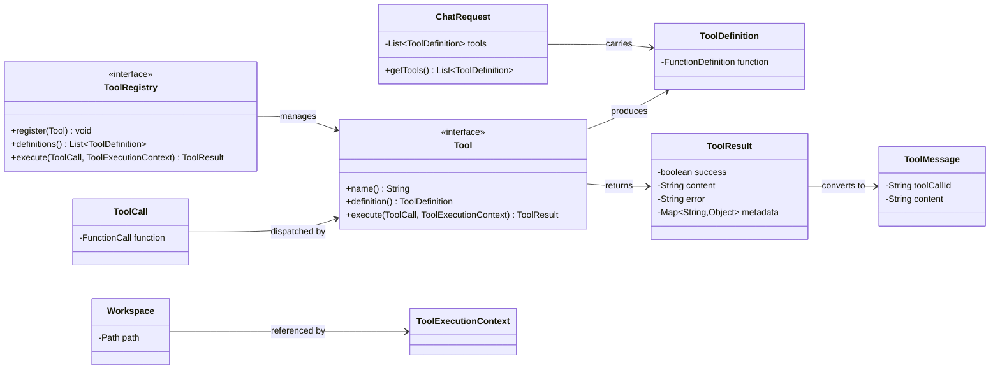
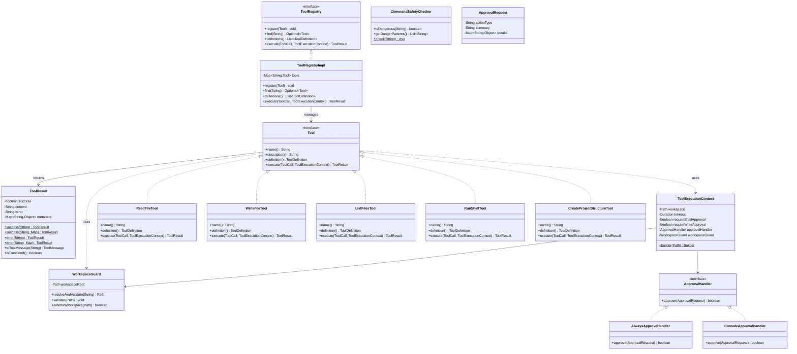
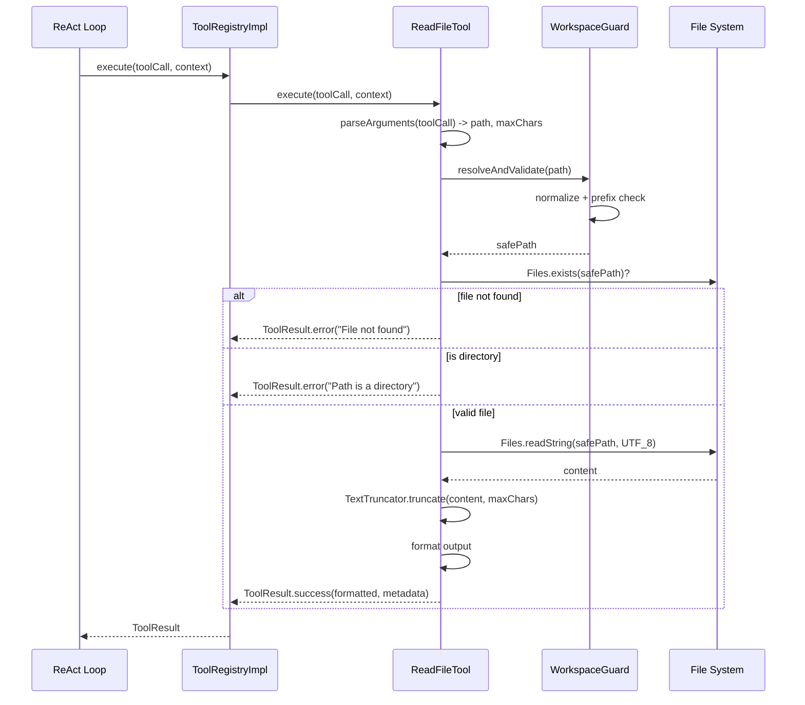
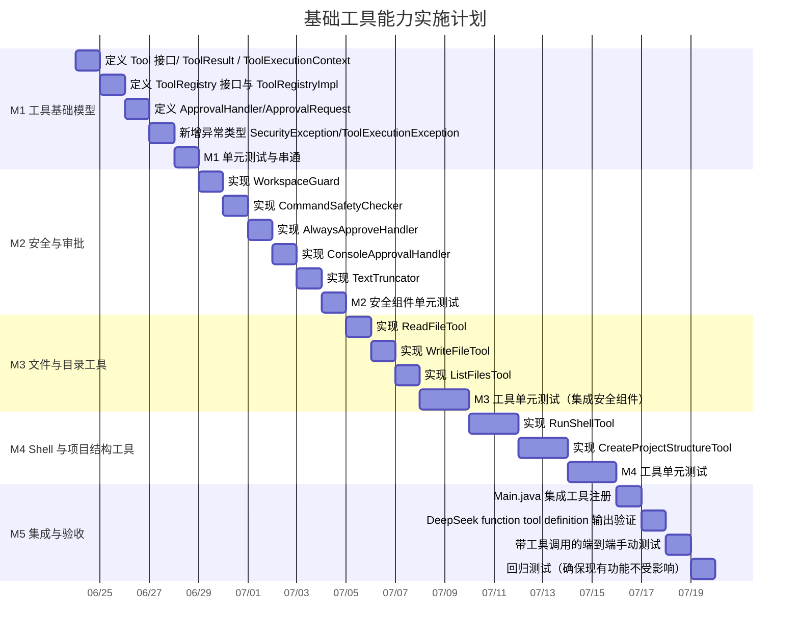

# FlyAgent 第二次开发 -- 基础工具能力 技术方案

> **文档版本：** 1.0
> **日期：** 2026-06-23
> **作者：** FlyAgent Team
> **对应 PRD：** `prd/第二次开发PRD-基础工具能力.md`
> **当前代码基线：** commit `dbd6e58` (M1 + M3)

---

## 目录

1. [文档信息](#1-文档信息)
2. [需求概述](#2-需求概述)
3. [技术架构设计](#3-技术架构设计)
4. [领域模型设计](#4-领域模型设计)
5. [核心组件详细设计](#5-核心组件详细设计)
6. [五个工具详细设计](#6-五个工具详细设计)
7. [与 ReAct Loop 的集成契约](#7-与-react-loop-的集成契约)
8. [实施计划与里程碑](#8-实施计划与里程碑)
9. [测试策略](#9-测试策略)
10. [风险与应对](#10-风险与应对)
11. [附录](#11-附录)

---

## 1. 文档信息

### 1.1 方案概述

本技术方案基于 PRD《第二次开发 PRD -- 基础工具能力》，在现有 M1（工程初始化与 DDD 骨架）+ M3（DeepSeek 模型调用）代码基线上，设计 FlyAgent 本地工具层的完整技术实现。方案遵循项目既有的六边形架构 + DDD 分层风格，确保工具层可直接被后续 ReAct Loop 复用。

### 1.2 核心设计决策

| 决策点 | 选择 | 理由 |
|--------|------|------|
| Tool 接口定位 | 领域端口接口，置于 `domain/tool/` | 与 ChatModelPort 一致，领域层定义契约，基础设施层提供实现 |
| ToolRegistry 定位 | 领域端口接口 + 基础设施实现 | 工具注册是领域概念，具体注册/查找逻辑由基础设施完成 |
| WorkspaceGuard / CommandSafetyChecker | 领域服务，置于 `domain/tool/` | 安全规则是纯业务逻辑，不依赖任何基础设施 |
| ApprovalHandler | 领域端口接口，置于 `domain/tool/` | 审批是工具执行的横切关注点，作为可替换策略 |
| 现有 ToolCall 复用 | 保持现有 `domain/tool/ToolCall` 不变 | 它正确表达了 API 反序列化契约；执行层通过解析 `arguments` JSON 字符串获取 Map |
| 依赖注入 | 继续 Pure DI（Main.java 手动组装） | 依赖树仍然简单，避免引入 DI 框架的启动开销 |

### 1.3 技术约束对齐

| 约束 | 实现策略 |
|------|----------|
| Java 17 + Maven | 继续使用现有构建体系，不新增构建插件 |
| 不依赖 Agent 框架 | 所有工具代码手写 |
| 文件操作用 `java.nio.file` | ReadFileTool / WriteFileTool / ListFilesTool 基于 NIO |
| Shell 执行用 `ProcessBuilder` | RunShellTool 基于 ProcessBuilder |
| JSON Schema 工具定义复用现有格式 | ToolDefinition / ToolParameter / JsonSchemaProperty 直接复用 |
| 工具层不直接依赖 DeepSeek 客户端 | Tool 接口只依赖领域模型，不感知基础设施 |

---

## 2. 需求概述

### 2.1 背景

M1+M3 完成后，FlyAgent 已具备：项目骨架、DeepSeek API 客户端、消息格式定义、工具格式定义和完整 `chat` 方法。当前局限：无多轮对话、无 ReAct 循环、**工具模型已就绪但工具未实现**。

第二次开发需要补齐 Agent 可执行本地动作的基础工具层，核心闭环：

```
工具定义 -> 工具注册 -> 参数校验 -> 安全检查 -> 执行工具 -> 返回 ToolResult -> 形成 Observation
```

### 2.2 开发目标

交付 5 个基础工具：`read_file`、`write_file`、`list_files`、`run_shell`、`create_project_structure`，以及支撑它们的统一接口、注册表、安全边界和审批机制。

### 2.3 非目标

完整 ReAct Loop、多轮自动执行、持久化、流式响应、patch 工具、沙箱、插件化加载。

---

## 3. 技术架构设计

### 3.1 整体分层与模块划分

新增组件在现有六边形架构中的定位：

```mermaid
graph TB
    subgraph "Interfaces Layer 接口层"
        CLI[AgentCli]
        CP[CommandParser]
        Presenter[ConsolePresenter]
    end

    subgraph "Application Layer 应用层"
        AgentSvc[AgentAppService]
        SessionSvc[SessionAppService]
        DTOs[AgentResponseDTO]
    end

    subgraph "Domain Layer 领域层"
        subgraph "chat"
            Port[ChatModelPort]
            Req[ChatRequest]
            Resp[ChatResponse]
        end
        subgraph "message"
            Msg[Message 体系]
        end
        subgraph "tool ★ 本次扩展"
            TD[ToolDefinition]
            TC[ToolCall]
            TI[Tool 接口 ★新]
            TR[ToolResult ★新]
            TReg[ToolRegistry 接口 ★新]
            TEC[ToolExecutionContext ★新]
            WG[WorkspaceGuard ★新]
            CSC[CommandSafetyChecker ★新]
            AH[ApprovalHandler 接口 ★新]
            AR[ApprovalRequest ★新]
        end
        subgraph "session"
            AS[AgentSession]
            WS[Workspace]
        end
        subgraph "task"
            AT[AgentTask]
        end
    end

    subgraph "Infrastructure Layer 基础设施层"
        DSCM[DeepSeekChatModel]
        subgraph "tools ★ 本次新增"
            TRI[ToolRegistryImpl]
            RFT[ReadFileTool]
            WFT[WriteFileTool]
            LFT[ListFilesTool]
            RST[RunShellTool]
            CPST[CreateProjectStructureTool]
            AAH[AlwaysApproveHandler]
            CAH[ConsoleApprovalHandler]
            TT[TextTruncator]
        end
    end

    CLI --> AgentSvc
    AgentSvc --> Port
    AgentSvc --> TReg
    AgentSvc --> AS
    DSCM -.-> Port
    TRI -.-> TReg
    RFT -.-> TI
    WFT -.-> TI
    LFT -.-> TI
    RST -.-> TI
    CPST -.-> TI
    AAH -.-> AH
    CAH -.-> AH
```



### 3.2 新增模块的职责与契约

| 层 | 包路径 | 类/接口 | 职责 |
|---|--------|---------|------|
| Domain | `domain.tool` | `Tool` (接口) | 工具统一端口，定义 name/description/definition/execute |
| Domain | `domain.tool` | `ToolResult` | 工具执行结果值对象 |
| Domain | `domain.tool` | `ToolRegistry` (接口) | 工具注册表端口 |
| Domain | `domain.tool` | `ToolExecutionContext` | 执行上下文值对象 |
| Domain | `domain.tool` | `WorkspaceGuard` | 路径安全校验领域服务 |
| Domain | `domain.tool` | `CommandSafetyChecker` | 命令安全检测领域服务 |
| Domain | `domain.tool` | `ApprovalHandler` (接口) | 审批处理器端口 |
| Domain | `domain.tool` | `ApprovalRequest` | 审批请求值对象 |
| Infrastructure | `infrastructure.tools` | `ToolRegistryImpl` | ToolRegistry 实现 |
| Infrastructure | `infrastructure.tools` | `ReadFileTool` | read_file 工具实现 |
| Infrastructure | `infrastructure.tools` | `WriteFileTool` | write_file 工具实现 |
| Infrastructure | `infrastructure.tools` | `ListFilesTool` | list_files 工具实现 |
| Infrastructure | `infrastructure.tools` | `RunShellTool` | run_shell 工具实现 |
| Infrastructure | `infrastructure.tools` | `CreateProjectStructureTool` | create_project_structure 工具实现 |
| Infrastructure | `infrastructure.tools` | `AlwaysApproveHandler` | 始终通过审批（测试用） |
| Infrastructure | `infrastructure.tools` | `ConsoleApprovalHandler` | 控制台交互审批 |
| Infrastructure | `infrastructure.tools` | `TextTruncator` | 文本截断工具类 |

### 3.3 依赖方向

```
interfaces.cli -> application.service
application.service -> domain.tool (Tool, ToolRegistry, ToolResult)
application.service -> domain.chat (ChatModelPort)
infrastructure.tools -> domain.tool (implements Tool, ToolRegistry, ApprovalHandler)
domain.tool -> domain.session (Workspace)
domain.tool -> common (exceptions)
```

**关键原则：** 工具实现在 infrastructure 层，但只依赖 domain 层的接口和模型，不依赖任何具体的 infrastructure 实现。

### 3.4 与现有领域模型的集成关系



**集成要点：**

1. `Tool.definition()` 返回 `ToolDefinition`，可直接放入 `ChatRequest.tools` 列表
2. `Tool.execute(ToolCall, ...)` 接收现有的 `ToolCall`（来自 API 响应），解析 `arguments` JSON 字符串
3. `ToolResult` 通过 `toToolMessage(toolCallId)` 转换为 `ToolMessage`，传回 DeepSeek
4. `ToolExecutionContext` 封装 `Workspace` 的 `Path`，作为所有工具的安全边界

---

## 4. 领域模型设计

### 4.1 Tool 统一接口

```java
package com.flyagent.domain.tool;

/**
 * 工具统一端口接口。
 *
 * <p>所有本地工具必须实现此接口。遵循端口/适配器模式：
 * 领域层定义契约，基础设施层提供具体实现。</p>
 */
public interface Tool {

    /**
     * 工具名称，全局唯一，对应 DeepSeek function.name。
     */
    String name();

    /**
     * 工具用途描述，用于模型理解何时调用该工具。
     */
    String description();

    /**
     * 生成工具定义（function calling 协议格式），可直接放入 ChatRequest.tools。
     */
    ToolDefinition definition();

    /**
     * 执行工具。
     *
     * @param call    工具调用请求（来自 DeepSeek 响应的 tool_calls）
     * @param context 执行上下文（workspace、超时、审批处理器等）
     * @return 执行结果，异常不得抛出到调用方，应封装为失败 ToolResult
     */
    ToolResult execute(ToolCall call, ToolExecutionContext context);
}
```

**设计要点：**
- `definition()` 返回现有 `ToolDefinition`，零适配成本对接 DeepSeek
- `execute()` 捕获所有异常转为 `ToolResult.error()`，防止工具异常导致 Agent 进程崩溃
- 接口置于 domain 层（端口），实现置于 infrastructure 层（适配器）

### 4.2 ToolResult

```java
package com.flyagent.domain.tool;

import com.flyagent.domain.message.ToolMessage;
import java.util.Collections;
import java.util.LinkedHashMap;
import java.util.Map;

/**
 * 工具执行结果值对象。
 *
 * <p>封装工具执行的全部产出，支持快速成功构造和失败构造。</p>
 */
public class ToolResult {

    private final boolean success;
    private final String content;
    private final String error;
    private final Map<String, Object> metadata;

    private ToolResult(boolean success, String content, String error, Map<String, Object> metadata) {
        this.success = success;
        this.content = content;
        this.error = error;
        this.metadata = metadata != null ? Collections.unmodifiableMap(new LinkedHashMap<>(metadata)) : Collections.emptyMap();
    }

    /** 构造成功结果 */
    public static ToolResult success(String content) {
        return new ToolResult(true, content, null, null);
    }

    /** 构造成功结果（带元数据） */
    public static ToolResult success(String content, Map<String, Object> metadata) {
        return new ToolResult(true, content, null, metadata);
    }

    /** 构造失败结果 */
    public static ToolResult error(String errorMessage) {
        return new ToolResult(false, null, errorMessage, null);
    }

    /** 构造失败结果（带元数据） */
    public static ToolResult error(String errorMessage, Map<String, Object> metadata) {
        return new ToolResult(false, null, errorMessage, metadata);
    }

    // getters...
    public boolean isSuccess() { return success; }
    public String getContent() { return content; }
    public String getError() { return error; }
    public Map<String, Object> getMetadata() { return metadata; }

    /** 是否有截断标记 */
    public boolean isTruncated() {
        return Boolean.TRUE.equals(metadata.get("truncated"));
    }

    /**
     * 转换为 ToolMessage（用于回传 DeepSeek）。
     *
     * @param toolCallId 关联的 tool_call id
     * @return ToolMessage 实例
     */
    public ToolMessage toToolMessage(String toolCallId) {
        String body;
        if (success) {
            body = content;
        } else {
            body = "Error: " + error;
        }
        return new ToolMessage(toolCallId, body);
    }
}
```

**与现有 ToolMessage 的关系：** `ToolResult.toToolMessage(toolCallId)` 是 `ToolResult -> Observation` 的转换桥梁，直接将工具执行结果封装为模型可理解的消息。

### 4.3 ToolExecutionContext

```java
package com.flyagent.domain.tool;

import java.nio.file.Path;
import java.time.Duration;

/**
 * 工具执行上下文值对象。
 *
 * <p>封装工具执行所需的全部运行时环境信息。</p>
 */
public class ToolExecutionContext {

    private final Path workspace;               // 工作目录根路径（来自 AgentSession.Workspace）
    private final Duration timeout;             // 执行超时（默认 120s）
    private final boolean requireShellApproval; // 执行 shell 是否需要审批
    private final boolean requireWriteApproval; // 写文件是否需要审批
    private final ApprovalHandler approvalHandler; // 审批处理器
    private final WorkspaceGuard workspaceGuard;   // 路径安全校验器

    // Builder 模式构造
    private ToolExecutionContext(Builder builder) { ... }

    public Path getWorkspace() { return workspace; }
    public Duration getTimeout() { return timeout; }
    public boolean isRequireShellApproval() { return requireShellApproval; }
    public boolean isRequireWriteApproval() { return requireWriteApproval; }
    public ApprovalHandler getApprovalHandler() { return approvalHandler; }
    public WorkspaceGuard getWorkspaceGuard() { return workspaceGuard; }

    public static Builder builder(Path workspace) {
        return new Builder(workspace);
    }

    public static class Builder {
        private final Path workspace;
        private Duration timeout = Duration.ofSeconds(120);
        private boolean requireShellApproval = true;
        private boolean requireWriteApproval = true;
        private ApprovalHandler approvalHandler;
        private WorkspaceGuard workspaceGuard;

        private Builder(Path workspace) {
            this.workspace = workspace;
        }

        public Builder timeout(Duration timeout) { this.timeout = timeout; return this; }
        public Builder requireShellApproval(boolean v) { this.requireShellApproval = v; return this; }
        public Builder requireWriteApproval(boolean v) { this.requireWriteApproval = v; return this; }
        public Builder approvalHandler(ApprovalHandler h) { this.approvalHandler = h; return this; }
        public Builder workspaceGuard(WorkspaceGuard g) { this.workspaceGuard = g; return this; }

        public ToolExecutionContext build() {
            if (this.workspaceGuard == null) {
                this.workspaceGuard = new WorkspaceGuard(workspace);
            }
            return new ToolExecutionContext(this);
        }
    }
}
```

### 4.4 ToolRegistry 接口

```java
package com.flyagent.domain.tool;

import java.util.List;
import java.util.Optional;

/**
 * 工具注册表端口接口。
 *
 * <p>管理工具注册、查找和执行的统一入口。</p>
 */
public interface ToolRegistry {

    /** 注册工具，重复名称抛出 IllegalArgumentException */
    void register(Tool tool);

    /** 按名称查找工具 */
    Optional<Tool> find(String name);

    /** 获取所有已注册工具的定义列表（可直接传入 ChatRequest.tools） */
    List<ToolDefinition> definitions();

    /** 执行工具调用 */
    ToolResult execute(ToolCall call, ToolExecutionContext context);

    /** 批量注册 */
    default void registerAll(Tool... tools) {
        for (Tool t : tools) {
            register(t);
        }
    }
}
```

### 4.5 ApprovalHandler 与 ApprovalRequest

```java
package com.flyagent.domain.tool;

import java.util.Map;

/**
 * 审批请求值对象。
 */
public class ApprovalRequest {

    private final String actionType;    // 操作类型：write_file / run_shell / create_project_structure
    private final String summary;       // 操作摘要（一行描述）
    private final Map<String, Object> details; // 详细信息（文件路径、命令内容等）

    public ApprovalRequest(String actionType, String summary, Map<String, Object> details) { ... }

    public String getActionType() { return actionType; }
    public String getSummary() { return summary; }
    public Map<String, Object> getDetails() { return details; }
}

/**
 * 审批处理器端口接口。
 *
 * <p>工具层通过此端口请求用户审批，不同场景切换不同实现。</p>
 */
@FunctionalInterface
public interface ApprovalHandler {
    /** 返回 true 表示审批通过 */
    boolean approve(ApprovalRequest request);
}
```

### 4.6 新增异常类型

为工具层新增专用异常，继承现有 `FlyAgentException`：

```java
// com.flyagent.common.exception.SecurityException.java
public class SecurityException extends FlyAgentException {
    public SecurityException(String message) { super(message); }
}

// com.flyagent.common.exception.ToolExecutionException.java
public class ToolExecutionException extends FlyAgentException {
    public ToolExecutionException(String message) { super(message); }
    public ToolExecutionException(String message, Throwable cause) { super(message, cause); }
}
```

### 4.7 领域模型类图



---

## 5. 核心组件详细设计

### 5.1 WorkspaceGuard -- 路径安全校验

**职责：** 确保所有文件和目录操作严格限制在 workspace 内。

**安全策略：**
1. 输入路径规范化后必须 `startsWith(workspaceRoot)`
2. 禁止 `../` 路径逃逸
3. 禁止绝对路径越权（除非已在 workspace 内）
4. 符号链接解析后重新校验

```java
package com.flyagent.domain.tool;

import com.flyagent.common.exception.SecurityException;
import java.io.IOException;
import java.nio.file.Files;
import java.nio.file.Path;

/**
 * Workspace 路径安全校验器。
 *
 * <p>领域服务，实现路径越权防护。纯逻辑，无外部依赖。</p>
 */
public class WorkspaceGuard {

    private final Path workspaceRoot;

    public WorkspaceGuard(Path workspaceRoot) {
        this.workspaceRoot = workspaceRoot.toAbsolutePath().normalize();
    }

    /**
     * 解析相对路径并校验安全性。
     *
     * @param relativePath 用户提供的相对路径
     * @return 安全的绝对路径
     * @throws SecurityException 当路径在 workspace 之外时
     */
    public Path resolveAndValidate(String relativePath) {
        Path resolved = workspaceRoot.resolve(relativePath).normalize();
        validate(resolved);
        // 解析符号链接后再次校验
        try {
            if (Files.isSymbolicLink(resolved)) {
                Path realPath = resolved.toRealPath();
                if (!realPath.startsWith(workspaceRoot)) {
                    throw new SecurityException(
                        "Symbolic link resolves outside workspace: " + relativePath);
                }
            }
        } catch (IOException e) {
            // 文件不存在等 IO 异常放行（由工具层后续处理），仅校验路径越权
            if (!resolved.startsWith(workspaceRoot)) {
                throw new SecurityException("Path is outside workspace: " + relativePath);
            }
        }
        return resolved;
    }

    /** 校验已解析的路径是否在 workspace 内 */
    public void validate(Path path) {
        Path normalized = path.normalize();
        if (!normalized.startsWith(workspaceRoot)) {
            throw new SecurityException(
                "Path traversal detected: " + path + " is outside workspace " + workspaceRoot);
        }
    }

    /** 判断是否在 workspace 内（不抛异常） */
    public boolean isWithinWorkspace(Path path) {
        return path.normalize().startsWith(workspaceRoot);
    }

    public Path getWorkspaceRoot() {
        return workspaceRoot;
    }
}
```

**攻击向量覆盖：**

| 攻击方式 | 示例 | 防护机制 |
|----------|------|----------|
| 相对路径逃逸 | `../../../etc/passwd` | `normalize().startsWith()` |
| 绝对路径越权 | `/etc/passwd` | `resolve()` 带 workspace 前缀后 normalize |
| 符号链接逃逸 | workspace/link -> /etc/ | `toRealPath()` 后二次校验 |
| 空路径/NPE | null / "" | 上层校验参数 |

### 5.2 CommandSafetyChecker -- 危险命令检测

**职责：** 识别并拦截危险 shell 命令，保护用户环境。

```java
package com.flyagent.domain.tool;

import java.util.List;
import java.util.regex.Pattern;

/**
 * 命令安全检测器。
 *
 * <p>领域服务，基于模式匹配检测危险命令。可通过环境变量 CONTEXT_SHELL 识别平台，
 * 按 OS 类型匹配相应的危险模式。</p>
 */
public class CommandSafetyChecker {

    private static final List<DangerPattern> DANGER_PATTERNS = List.of(
        // 通用危险模式
        DangerPattern.of("rm -rf /", "(?i)\\brm\\s+-rf\\s+/\\b"),
        DangerPattern.of("rm -rf /*", "(?i)\\brm\\s+-rf\\s+/\\*\\b"),
        DangerPattern.of("rm -rf ~", "(?i)\\brm\\s+-rf\\s+~\\b"),
        DangerPattern.of("del /s /q C:\\\\", "(?i)\\bdel\\s+/[sS]\\s+/[qQ]\\s+[A-Z]:\\\\"),
        DangerPattern.of("git reset --hard", "(?i)\\bgit\\s+reset\\s+--hard\\b"),
        DangerPattern.of("git push --force origin main", "(?i)\\bgit\\s+push\\s+.*--force\\s+origin\\s+(main|master)\\b"),
        DangerPattern.of("format disk", "(?i)\\bformat\\s+[A-Z]:\\b"),
        DangerPattern.of("shutdown", "(?i)\\bshutdown\\b"),
        DangerPattern.of("reboot", "(?i)\\breboot\\b"),
        DangerPattern.of("dd if=", "(?i)\\bdd\\s+if="),
        DangerPattern.of("mkfs", "(?i)\\bmkfs\\b"),
        DangerPattern.of("chmod 777 /", "(?i)\\bchmod\\s+777\\s+/"),
        DangerPattern.of("fork bomb", "(?i):\\(\\)\\s*\\{\\s*:\\|:&\\s*\\};:")
    );

    /**
     * 批量检测命令是否包含危险模式。
     *
     * @param command 待检测的完整命令字符串
     * @return 匹配到的第一个危险模式描述，无匹配则返回 null
     */
    public String detectDanger(String command) {
        if (command == null || command.isBlank()) {
            return null;
        }
        for (DangerPattern dp : DANGER_PATTERNS) {
            if (dp.pattern.matcher(command).find()) {
                return dp.description;
            }
        }
        return null;
    }

    /**
     * 判定命令是否危险。
     */
    public boolean isDangerous(String command) {
        return detectDanger(command) != null;
    }

    /**
     * 强制执行安全检测，危险命令直接拒绝。
     *
     * @param command 待检测命令
     * @throws SecurityException 当命令匹配危险模式时
     */
    public void check(String command) {
        String detected = detectDanger(command);
        if (detected != null) {
            throw new SecurityException(
                "Dangerous command detected: " + detected + ". Command refused for safety.");
        }
    }

    /**
     * 内置危险模式：描述 + 正则。
     */
    private static class DangerPattern {
        final String description;
        final Pattern pattern;

        DangerPattern(String description, Pattern pattern) {
            this.description = description;
            this.pattern = pattern;
        }

        static DangerPattern of(String description, String regex) {
            return new DangerPattern(description, Pattern.compile(regex));
        }
    }
}
```

### 5.3 TextTruncator -- 文本截断工具类

```java
package com.flyagent.infrastructure.tools;

/**
 * 文本截断工具。
 *
 * <p>对超长工具输出进行截断，防止大量内容挤占模型上下文窗口。</p>
 */
public final class TextTruncator {

    private TextTruncator() {}

    /**
     * 截断文本。
     *
     * @param text      原始文本
     * @param maxChars  最大字符数
     * @param label     内容标签（如 "File: pom.xml"），用于截断提示
     * @return 截断后的文本，未超限则原文返回
     */
    public static String truncate(String text, int maxChars, String label) {
        if (text == null) {
            return "";
        }
        if (text.length() <= maxChars) {
            return text;
        }
        return text.substring(0, maxChars) + "\n\n[... truncated at " + maxChars
            + " characters, total " + text.length() + " characters]";
    }
}
```

### 5.4 ApprovalHandler 实现

#### AlwaysApproveHandler（测试用）

```java
package com.flyagent.infrastructure.tools;

import com.flyagent.domain.tool.ApprovalHandler;
import com.flyagent.domain.tool.ApprovalRequest;
import org.slf4j.Logger;
import org.slf4j.LoggerFactory;

public class AlwaysApproveHandler implements ApprovalHandler {
    private static final Logger log = LoggerFactory.getLogger(AlwaysApproveHandler.class);

    @Override
    public boolean approve(ApprovalRequest request) {
        log.info("Auto-approved: action={}, summary={}", request.getActionType(), request.getSummary());
        return true;
    }
}
```

#### ConsoleApprovalHandler（CLI 交互用）

```java
package com.flyagent.infrastructure.tools;

import com.flyagent.domain.tool.ApprovalHandler;
import com.flyagent.domain.tool.ApprovalRequest;
import org.slf4j.Logger;
import org.slf4j.LoggerFactory;
import java.util.Scanner;

public class ConsoleApprovalHandler implements ApprovalHandler {
    private static final Logger log = LoggerFactory.getLogger(ConsoleApprovalHandler.class);

    @Override
    public boolean approve(ApprovalRequest request) {
        System.out.println();
        System.out.println("=== Approval Required ===");
        System.out.println("Action: " + request.getActionType());
        System.out.println("Summary: " + request.getSummary());
        request.getDetails().forEach((k, v) ->
            System.out.println("  " + k + ": " + v));
        System.out.print("Approve? [y/N]: ");

        Scanner scanner = new Scanner(System.in);
        String line = scanner.nextLine().trim().toLowerCase();
        boolean approved = "y".equals(line) || "yes".equals(line);
        log.info("Approval result: {} for action={}", approved, request.getActionType());
        return approved;
    }
}
```

**注意：** `ConsoleApprovalHandler` 持有一个 `Scanner(System.in)`。由于 `System.in` 在整个 CLI 主循环中已由 `AgentCli` 打开，这里需要共享同一个 Scanner 实例或使用不同的交互方式。正式集成（M5）时，建议通过 `ApprovalHandler` 的自定义实现，由 `AgentCli` 提供 Scanner 或回调，避免重复打开 `System.in`。当前设计为过渡方案，M5 集成时统一处理。

### 5.5 ToolRegistryImpl -- 工具注册表实现

```java
package com.flyagent.infrastructure.tools;

import com.flyagent.domain.tool.*;
import java.util.*;
import java.util.concurrent.ConcurrentHashMap;

/**
 * ToolRegistry 的默认实现。
 *
 * <p>线程安全的工具注册表，使用 ConcurrentHashMap 存储。</p>
 */
public class ToolRegistryImpl implements ToolRegistry {

    private final Map<String, Tool> tools = new ConcurrentHashMap<>();

    @Override
    public void register(Tool tool) {
        if (tools.containsKey(tool.name())) {
            throw new IllegalArgumentException(
                "Tool already registered: " + tool.name());
        }
        tools.put(tool.name(), tool);
    }

    @Override
    public Optional<Tool> find(String name) {
        return Optional.ofNullable(tools.get(name));
    }

    @Override
    public List<ToolDefinition> definitions() {
        return tools.values().stream()
            .map(Tool::definition)
            .toList();
    }

    @Override
    public ToolResult execute(ToolCall call, ToolExecutionContext context) {
        String toolName = extractToolName(call);
        Optional<Tool> tool = find(toolName);
        if (tool.isEmpty()) {
            return ToolResult.error("Unknown tool: " + toolName);
        }
        try {
            return tool.get().execute(call, context);
        } catch (SecurityException e) {
            return ToolResult.error(e.getMessage(), Map.of("security_violation", true));
        } catch (Exception e) {
            return ToolResult.error(
                "Tool execution failed: " + e.getMessage(),
                Map.of("exception_type", e.getClass().getSimpleName())
            );
        }
    }

    private String extractToolName(ToolCall call) {
        // 现有 ToolCall 的 function.name 即工具名
        return call.getFunction().getName();
    }
}
```

**关键设计点：**
- `execute()` 方法提供两层安全网：第一层是 `Tool` 实现自己的 try-catch，第二层是 `ToolRegistryImpl` 的兜底捕获
- 工具名重复注册直接抛 `IllegalArgumentException`（fail-fast）
- `SecurityException` 被特殊标记在 metadata 中

### 5.6 ToolCall arguments 解析策略

当前 `domain/tool/ToolCall` 的 `arguments` 字段是 JSON String（来自 DeepSeek API 响应）。工具在执行时需要将其解析为 `Map<String, Object>`。

**方案：** 在 `infrastructure/tools` 中提供参数解析工具方法：

```java
package com.flyagent.infrastructure.tools;

import com.fasterxml.jackson.core.type.TypeReference;
import com.fasterxml.jackson.databind.ObjectMapper;
import java.util.Collections;
import java.util.Map;

/**
 * ToolCall 参数解析工具。
 */
public final class ToolArgumentParser {
    private static final ObjectMapper MAPPER = new ObjectMapper();

    private ToolArgumentParser() {}

    /**
     * 将 ToolCall 的 JSON arguments 字符串解析为 Map。
     */
    public static Map<String, Object> parseArguments(ToolCall call) {
        String argsJson = call.getFunction().getArguments();
        if (argsJson == null || argsJson.isBlank()) {
            return Collections.emptyMap();
        }
        try {
            return MAPPER.readValue(argsJson, new TypeReference<Map<String, Object>>() {});
        } catch (Exception e) {
            return Collections.emptyMap();
        }
    }
}
```

**设计理由：** 不修改现有 `ToolCall`（避免影响 API 反序列化逻辑），而是在执行层添加工厂方法。这样领域模型保持清洁，工具实现自主决定如何解析参数。

---

## 6. 五个工具详细设计

### 6.1 read_file

#### 参数定义

| 参数 | 类型 | 必填 | 默认值 | 说明 |
|------|------|------|--------|------|
| `path` | string | 是 | -- | 相对 workspace 的文件路径 |
| `maxChars` | integer | 否 | 20000 | 最大读取字符数 |

#### ToolDefinition 构造

```java
new ToolDefinition(
    "read_file",
    "Read the contents of a text file within the workspace. "
        + "Returns the file content with line numbers and truncates if too large.",
    new ToolParameter(
        Map.of(
            "path", new JsonSchemaProperty("string",
                "Relative path to the file within the workspace"),
            "maxChars", new JsonSchemaProperty("integer",
                "Maximum number of characters to read (default: 20000)")
        ),
        List.of("path")
    )
)
```

#### 执行流程

```
1. 解析参数：path (required), maxChars (default 20000)
2. WorkspaceGuard.resolveAndValidate(path) -- 安全校验
3. 检查文件存在性：Files.exists(resolved)
   3a. 不存在 -> ToolResult.error("File not found: ...")
4. 检查是否为常规文件：Files.isRegularFile(resolved)
   4a. 目录 -> ToolResult.error("Path is a directory: ...")
5. 读取文件：Files.readString(resolved, StandardCharsets.UTF_8)
6. 截断（如超过 maxChars）
7. 格式化输出：
   "File: {relativePath}
    Chars: {totalChars}

    {content}"
8. 返回 ToolResult.success(formatted, metadata{path, chars, truncated})
```

#### 序列图



#### 边界情况处理

| 场景 | 处理 |
|------|------|
| 大文件 (>maxChars) | 截断，metadata 标记 `truncated=true` |
| 二进制文件 | 尝试 UTF-8 读取，`MalformedInputException` 时返回 "Cannot read binary file" |
| 空文件 | 正常返回，content 为空字符串 |
| path 为空 | ToolResult.error("Required parameter 'path' is missing") |

### 6.2 write_file

#### 参数定义

| 参数 | 类型 | 必填 | 默认值 | 说明 |
|------|------|------|--------|------|
| `path` | string | 是 | -- | 相对 workspace 的文件路径 |
| `content` | string | 是 | -- | 写入内容 |
| `overwrite` | boolean | 否 | false | 是否允许覆盖已有文件 |

#### ToolDefinition 构造

```java
new ToolDefinition(
    "write_file",
    "Create or overwrite a text file within the workspace. "
        + "Parent directories are created automatically. "
        + "By default, existing files are NOT overwritten.",
    new ToolParameter(
        Map.of(
            "path", new JsonSchemaProperty("string",
                "Relative path to the file within the workspace"),
            "content", new JsonSchemaProperty("string",
                "Content to write to the file"),
            "overwrite", new JsonSchemaProperty("boolean",
                "Whether to overwrite if file already exists (default: false)")
        ),
        List.of("path", "content")
    )
)
```

#### 执行流程

```
1. 解析参数：path (required), content (required), overwrite (default false)
2. WorkspaceGuard.resolveAndValidate(path)
3. 检查文件是否存在
   3a. 存在 && overwrite=false -> ToolResult.error("File already exists. Set overwrite=true to replace.")
4. 审批：调用 ApprovalHandler.approve(ApprovalRequest)
   4a. 拒绝 -> ToolResult.error("Write operation rejected by user.")
5. 创建父目录：Files.createDirectories(resolved.getParent())
6. 写入文件：Files.writeString(resolved, content, StandardCharsets.UTF_8)
7. 返回 ToolResult.success(formatted, metadata{path, chars, overwritten})
```

#### 审批请求构造

```java
new ApprovalRequest(
    "write_file",
    "Write file: " + relativePath + " (" + content.length() + " chars)",
    Map.of(
        "path", relativePath,
        "absolutePath", safePath.toString(),
        "size", content.length(),
        "overwrite", overwrite
    )
)
```

### 6.3 list_files

#### 参数定义

| 参数 | 类型 | 必填 | 默认值 | 说明 |
|------|------|------|--------|------|
| `path` | string | 否 | `.` | 相对 workspace 的目录路径 |
| `maxDepth` | integer | 否 | 3 | 最大目录深度 |
| `includeHidden` | boolean | 否 | false | 是否包含隐藏文件 |

#### 默认忽略目录

硬编码在工具实现中：
```java
private static final Set<String> DEFAULT_IGNORED_DIRS = Set.of(
    ".git", "target", "node_modules", ".idea", "__pycache__"
);
```

#### ToolDefinition 构造

```java
new ToolDefinition(
    "list_files",
    "List directory structure within the workspace using tree-like format. "
        + "Default ignores .git, target, node_modules, .idea directories.",
    new ToolParameter(
        Map.of(
            "path", new JsonSchemaProperty("string",
                "Directory path relative to workspace (default: '.')"),
            "maxDepth", new JsonSchemaProperty("integer",
                "Maximum directory depth to traverse (default: 3)"),
            "includeHidden", new JsonSchemaProperty("boolean",
                "Include hidden files/directories (default: false)")
        ),
        List.of()
    )
)
```

#### 执行流程

```
1. 解析参数：path (default "."), maxDepth (default 3), includeHidden (default false)
2. WorkspaceGuard.resolveAndValidate(path)
3. 检查目录存在性：Files.isDirectory(resolved)
   3a. 不存在/不是目录 -> ToolResult.error(...)
4. 递归遍历：Files.walkFileTree(resolved, maxDepth)
   - 忽略 hidden 文件（includeHidden=false 时）
   - 忽略 DEFAULT_IGNORED_DIRS
5. 格式化为树状结构
6. 截断（如超过 30000 字符）
7. 返回 ToolResult.success(tree)
```

#### 树状格式输出约定

```
{relativePath}/
├── pom.xml
├── src/
│   ├── main/
│   │   ├── java/
│   │   │   └── com/
│   │   │       └── example/
│   │   │           └── App.java
│   │   └── resources/
│   └── test/
│       └── java/
│           └── com/
│               └── example/
│                   └── AppTest.java
└── README.md

{N} files, {M} directories
```

### 6.4 run_shell

#### 参数定义

| 参数 | 类型 | 必填 | 默认值 | 说明 |
|------|------|------|--------|------|
| `command` | string | 是 | -- | 待执行命令 |
| `timeoutSeconds` | integer | 否 | 120 | 超时秒数 |

#### ToolDefinition 构造

```java
new ToolDefinition(
    "run_shell",
    "Execute a shell command within the workspace directory. "
        + "Commands are subject to safety checks and approval. "
        + "Default timeout is 120 seconds. Output is truncated at 30000 characters.",
    new ToolParameter(
        Map.of(
            "command", new JsonSchemaProperty("string",
                "Shell command to execute"),
            "timeoutSeconds", new JsonSchemaProperty("integer",
                "Command timeout in seconds (default: 120)")
        ),
        List.of("command")
    )
)
```

#### 执行流程

```
1. 解析参数：command (required), timeoutSeconds (default 120)
2. CommandSafetyChecker.check(command) -- 危险命令拦截
   2a. 危险 -> ToolResult.error("Dangerous command detected: ...")
3. 审批：ApprovalHandler.approve(ApprovalRequest)
   3a. 拒绝 -> ToolResult.error("Shell execution rejected by user.")
4. 使用 ProcessBuilder 执行：
   - directory = workspace
   - redirectErrorStream = false（分开捕获 stdout/stderr）
5. Process.waitFor(timeoutSeconds, SECONDS)
   5a. 超时 -> process.destroyForcibly() -> ToolResult.error("Command timed out")
6. 读取 stdout 和 stderr，分别截断
7. 返回 ToolResult.success(output, metadata{exitCode, truncated, durationMs})
```

#### ProcessBuilder 构造细节

```java
// 跨平台 shell 执行：Windows 用 cmd /c，Unix 用 sh -c
String[] cmdArgs;
String osName = System.getProperty("os.name").toLowerCase();
if (osName.contains("win")) {
    cmdArgs = new String[]{"cmd", "/c", command};
} else {
    cmdArgs = new String[]{"sh", "-c", command};
}

ProcessBuilder pb = new ProcessBuilder(cmdArgs);
pb.directory(workspace.toFile());
pb.redirectErrorStream(false);

Process process = pb.start();
```

#### 输出格式约定

```
Command: mvn compile
ExitCode: 0
Duration: 3421ms

STDOUT:
[INFO] Scanning for projects...
[INFO] BUILD SUCCESS

STDERR:
(empty)
```

### 6.5 create_project_structure

#### 参数定义

| 参数 | 类型 | 必填 | 默认值 | 说明 |
|------|------|------|--------|------|
| `projectType` | string | 是 | -- | 项目类型（一期仅 `maven-java`） |
| `basePath` | string | 否 | `.` | 创建位置（相对 workspace） |
| `groupId` | string | 否 | `com.example` | Maven groupId |
| `artifactId` | string | 否 | `demo` | Maven artifactId |
| `packageName` | string | 否 | 根据 groupId 推导 | Java 包名 |
| `overwrite` | boolean | 否 | false | 是否覆盖已有文件 |

#### ToolDefinition 构造

```java
new ToolDefinition(
    "create_project_structure",
    "Create a standard project directory structure with initial files. "
        + "Supported project types: maven-java.",
    new ToolParameter(
        Map.of(
            "projectType", new JsonSchemaProperty("string",
                "Project type (currently only 'maven-java')",
                List.of("maven-java")),
            "basePath", new JsonSchemaProperty("string",
                "Where to create the project, relative to workspace (default: '.')"),
            "groupId", new JsonSchemaProperty("string",
                "Maven groupId (default: 'com.example')"),
            "artifactId", new JsonSchemaProperty("string",
                "Maven artifactId (default: 'demo')"),
            "packageName", new JsonSchemaProperty("string",
                "Java package name (overrides groupId derivation if set)"),
            "overwrite", new JsonSchemaProperty("boolean",
                "Overwrite existing files (default: false)")
        ),
        List.of("projectType")
    )
)
```

#### maven-java 模板

需要创建的文件及其内容：

| 文件路径 | 内容说明 |
|----------|----------|
| `pom.xml` | 标准 Maven POM，使用 template 填充 groupId/artifactId；Java 17 |
| `src/main/java/{package}/App.java` | 简单 Hello World 主类 |
| `src/test/java/{package}/AppTest.java` | JUnit 5 基本测试骨架 |
| `README.md` | 包含项目名、构建和运行说明 |

#### 执行流程

```
1. 解析参数：projectType (required), basePath (default "."), groupId, artifactId, packageName, overwrite
2. 校验 projectType（一期仅 "maven-java"）
   2a. 非法 -> ToolResult.error("Unsupported project type: ...")
3. WorkspaceGuard.resolveAndValidate(basePath)
4. 计算 packagePath：packageName 转目录路径（点号 -> 斜杠）
5. 采集待创建文件列表（绝对路径 + 内容模板）
6. 审批（如开启 write approval）
   6a. 拒绝 -> ToolResult.error("Project creation rejected by user.")
7. 逐个创建文件：
   a. 检查是否已存在，存在且 !overwrite -> 记录冲突
   b. Files.createDirectories(parent)
   c. Files.writeString(path, content, UTF_8)
   d. 记录 "created" 或 "skipped"
8. 汇总结果，返回 ToolResult
```

#### pom.xml 模板策略

以代码内嵌模板字符串 + 占位符替换实现（不引入外部模板引擎）：

```java
private String generatePom(String groupId, String artifactId) {
    return """
        <?xml version="1.0" encoding="UTF-8"?>
        <project xmlns="http://maven.apache.org/POM/4.0.0"
                 xmlns:xsi="http://www.w3.org/2001/XMLSchema-instance"
                 xsi:schemaLocation="http://maven.apache.org/POM/4.0.0
                                     http://maven.apache.org/xsd/maven-4.0.0.xsd">
            <modelVersion>4.0.0</modelVersion>
            <groupId>%s</groupId>
            <artifactId>%s</artifactId>
            <version>1.0-SNAPSHOT</version>
            <packaging>jar</packaging>
            <properties>
                <maven.compiler.source>17</maven.compiler.source>
                <maven.compiler.target>17</maven.compiler.target>
                <project.build.sourceEncoding>UTF-8</project.build.sourceEncoding>
            </properties>
        </project>
        """.formatted(groupId, artifactId);
}
```

---

## 7. 与 ReAct Loop 的集成契约

### 7.1 ToolResult -> Observation 转换规则

ReAct Loop 的 Observation 由 `ToolResult` 转换而来：

| ToolResult 状态 | Observation 内容 | 来源 |
|----------------|------------------|------|
| `success=true` | `content` 字段原文 | `ToolResult.getContent()` |
| `success=false` | `"Error: " + error` | `ToolResult.getError()` |

转换方法已内置于 `ToolResult.toToolMessage(toolCallId)`：

```java
// ReAct Loop 中的用法
for (ToolCall tc : assistantMessage.getToolCalls()) {
    ToolResult result = toolRegistry.execute(tc, context);
    // 将结果作为 ToolMessage 加入消息历史
    messages.add(result.toToolMessage(tc.getId()));
}
// 再次调用 chatModel.chat(request.withMessages(messages)) 进行下一轮
```

### 7.2 ToolDefinition -> DeepSeek function tool 格式映射

`Tool.definition()` 返回的 `ToolDefinition` 对象可直接序列化为 DeepSeek API 的 `tools` 字段。现有 `DeepSeekHttpClient.buildRequestBody()` 已支持：

```java
if (request.getTools() != null && !request.getTools().isEmpty()) {
    body.put("tools", request.getTools());
}
```

**注册工具到 ChatRequest 的完整链路：**

```java
// 1. 注册工具
ToolRegistry registry = new ToolRegistryImpl();
registry.register(new ReadFileTool());
registry.register(new WriteFileTool());
// ... 注册所有工具

// 2. 构造 ChatRequest（携带工具定义）
ChatRequest request = ChatRequest.builder()
    .messages(messages)
    .tools(registry.definitions())  // List<ToolDefinition>
    .build();

// 3. 调用模型
ChatResponse response = chatModel.chat(request);

// 4. 检查是否有工具调用
ChatChoice choice = response.firstChoice();
if (choice != null && choice.getMessage().hasToolCalls()) {
    for (ToolCall tc : choice.getMessage().getToolCalls()) {
        ToolResult result = registry.execute(tc, context);
        // result.toToolMessage(tc.getId()) 回传模型
    }
}
```

### 7.3 JSON 序列化兼容性

所有领域对象已通过 Jackson 注解驱动序列化。工具层的序列化要求：

| 对象 | 序列化方式 | 说明 |
|------|-----------|------|
| `ToolDefinition` | 现有（无需改动） | 已通过 Jackson 序列化为 `{"type":"function","function":{...}}` |
| `ToolCall` | 现有（无需改动） | 已通过 `@JsonCreator` + `@JsonProperty` 反序列化 |
| `ToolResult` | 不直接序列化（通过 `toToolMessage` 转换） | ToolMessage 已有完整的 Jackson 支持 |
| `ToolExecutionContext` | 不序列化 | 纯运行时对象 |

### 7.4 finish_reason 处理契约

| `finish_reason` | 含义 | ReAct Loop 行为 |
|-----------------|------|----------------|
| `stop` | 模型输出最终回答 | 提取文本，结束循环 |
| `tool_calls` | 模型请求调用工具 | 执行工具，将结果回传，继续循环 |
| `length` | 超长截断 | 记录日志，按 `stop` 处理 |

---

## 8. 实施计划与里程碑

### 8.1 里程碑总览



### 8.2 M1：工具基础模型（预计 3 天）

**交付物：**

| 序号 | 文件 | 描述 |
|------|------|------|
| 1 | `domain/tool/Tool.java` | 工具统一端口接口 |
| 2 | `domain/tool/ToolResult.java` | 执行结果值对象 |
| 3 | `domain/tool/ToolExecutionContext.java` | 执行上下文值对象 |
| 4 | `domain/tool/ToolRegistry.java` | 工具注册表端口接口 |
| 5 | `domain/tool/ApprovalHandler.java` | 审批处理器端口接口 |
| 6 | `domain/tool/ApprovalRequest.java` | 审批请求值对象 |
| 7 | `infrastructure/tools/ToolRegistryImpl.java` | 注册表实现 |
| 8 | `infrastructure/tools/ToolArgumentParser.java` | 参数解析工具 |
| 9 | `common/exception/SecurityException.java` | 安全异常 |
| 10 | `common/exception/ToolExecutionException.java` | 工具执行异常 |

**验收标准：**
- Tool 接口编译通过，所有方法签名符合 PRD 要求
- ToolRegistry 可注册/查找/获取定义列表
- ToolResult 工厂方法和 `toToolMessage()` 转换正确
- ToolExecutionContext Builder 正确构造，默认值合理

**依赖：** 无外部依赖，可独立开发

### 8.3 M2：安全与审批（预计 4.5 天）

**交付物：**

| 序号 | 文件 | 描述 |
|------|------|------|
| 1 | `domain/tool/WorkspaceGuard.java` | 路径安全校验领域服务 |
| 2 | `domain/tool/CommandSafetyChecker.java` | 命令安全检测领域服务 |
| 3 | `infrastructure/tools/AlwaysApproveHandler.java` | 始终审批通过实现 |
| 4 | `infrastructure/tools/ConsoleApprovalHandler.java` | 控制台交互审批实现 |
| 5 | `infrastructure/tools/TextTruncator.java` | 文本截断工具 |

**验收标准：**
- WorkspaceGuard 正确拦截 `../` 逃逸、绝对路径、符号链接
- CommandSafetyChecker 正确识别 rm -rf /, shutdown, reboot, git reset --hard 等危险命令
- AlwaysApproveHandler 始终返回 true
- TextTruncator 正确截断超长文本

**依赖：** M1（ToolExecutionContext 需要 WorkspaceGuard 和 ApprovalHandler）

### 8.4 M3：文件与目录工具（预计 4.5 天）

**交付物：**

| 序号 | 文件 | 描述 |
|------|------|------|
| 1 | `infrastructure/tools/ReadFileTool.java` | 文件读取工具 |
| 2 | `infrastructure/tools/WriteFileTool.java` | 文件写入工具 |
| 3 | `infrastructure/tools/ListFilesTool.java` | 目录列表工具 |

**验收标准（对应 PRD 第 11、12 章）：**
- read_file：存在文件返回内容；不存在/目录/越权返回失败；大文件截断
- write_file：创建新文件；自动创建父目录；默认不覆盖；审批拒绝不写入
- list_files：树状输出；默认忽略 .git/target/node_modules/.idea；maxDepth 限制生效

**依赖：** M2（需要 WorkspaceGuard、TextTruncator、ApprovalHandler）

### 8.5 M4：Shell 与项目结构工具（预计 4.5 天）

**交付物：**

| 序号 | 文件 | 描述 |
|------|------|------|
| 1 | `infrastructure/tools/RunShellTool.java` | Shell 命令执行工具 |
| 2 | `infrastructure/tools/CreateProjectStructureTool.java` | 项目结构创建工具 |

**验收标准：**
- run_shell：安全命令正常执行；失败命令返回非 0 exitCode；危险命令被拒绝；超时终止；审批控制
- create_project_structure：maven-java 结构正确创建；默认不覆盖；非法 projectType 返回失败；越权路径失败

**依赖：** M2（需要 CommandSafetyChecker、WorkspaceGuard、ApprovalHandler）

### 8.6 M5：集成与验收（预计 2.5 天）

**交付物：**

| 序号 | 描述 |
|------|------|
| 1 | `Main.java` 更新：注册 5 个工具，构造 ToolExecutionContext，注入 ToolRegistry |
| 2 | 输出 5 个工具的 DeepSeek function tool JSON Schema 定义并验证格式 |
| 3 | 工具调用手动测试（通过直接构造 ToolCall 调用各工具） |
| 4 | 回归测试：确保现有 CLI 交互、ChatRequest/ChatResponse 不受影响 |

**验收标准（PRD 第 11 章全量）：**
- 所有 14 条验收标准逐条验证通过
- 全部单元测试通过
- 现有测试无回归

**依赖：** M3 + M4

### 8.7 Main.java 变更预览

```java
// Main.java 中新增的依赖组装
// 5. 初始化工具层
ToolRegistry toolRegistry = new ToolRegistryImpl();
toolRegistry.registerAll(
    new ReadFileTool(),
    new WriteFileTool(),
    new ListFilesTool(),
    new RunShellTool(),
    new CreateProjectStructureTool()
);

WorkspaceGuard workspaceGuard = new WorkspaceGuard(workspace.toPath());
ApprovalHandler approvalHandler = new ConsoleApprovalHandler();
ToolExecutionContext toolContext = ToolExecutionContext.builder(workspace.toPath())
    .workspaceGuard(workspaceGuard)
    .approvalHandler(approvalHandler)
    .requireWriteApproval(true)
    .requireShellApproval(true)
    .build();

// 注入 toolRegistry 和 toolContext 到 AgentAppService
AgentAppService agentService = new AgentAppService(
    chatModel, sessionService, toolRegistry, toolContext);
```

---

## 9. 测试策略

### 9.1 测试分层

| 层级 | 测试类型 | 框架 | 覆盖目标 |
|------|---------|------|----------|
| 单元测试 | 领域模型 / 领域服务 | JUnit 5 + AssertJ | WorkspaceGuard, CommandSafetyChecker, ToolResult, ToolRegistryImpl |
| 单元测试 | 工具实现 | JUnit 5 + AssertJ + Mockito | 5 个 Tool 实现类，mock ApprovalHandler |
| 集成测试 | 工具 + 文件系统 | JUnit 5 + 临时目录 | 真实文件读写、ProcessBuilder 执行 |
| 回归测试 | 现有测试 | JUnit 5 | ChatRequest / MessageSerialization / AgentSession / DeepSeekResponseParser |

### 9.2 单元测试覆盖矩阵

#### M1 测试用例

| 测试类 | 用例 | 覆盖场景 |
|--------|------|----------|
| `ToolResultTest` | 5 | success/error 构造、metadata 不可变、toToolMessage 转换、isTruncated 判定 |
| `ToolRegistryImplTest` | 5 | 注册/查找/重复注册失败/未知工具返回失败/definitions 集合正确性 |
| `ToolExecutionContextTest` | 3 | Builder 默认值、自定义值、workspaceGuard 非空断言 |

#### M2 测试用例

| 测试类 | 用例 | 覆盖场景 |
|--------|------|----------|
| `WorkspaceGuardTest` | 8 | 正常路径、`../` 逃逸、绝对路径、符号链接、空路径、多级目录正常、边界（workspace 内文件）、null 路径 |
| `CommandSafetyCheckerTest` | 10 | rm -rf /, del /s, git reset --hard, format, shutdown, reboot, dd, mkfs, 正常命令（echo/mvn/...）, 空命令 |
| `TextTruncatorTest` | 4 | 正常截断、不超限、null 输入、边界值（恰好 maxChars） |
| `AlwaysApproveHandlerTest` | 1 | 始终返回 true |
| `ConsoleApprovalHandlerTest` | -- | 手动测试（依赖 System.in），M5 集成时验证 |

#### M3 测试用例（对应 PRD 第 12.1-12.3 章）

| 测试类 | 用例 | 覆盖场景 |
|--------|------|----------|
| `ReadFileToolTest` | 6 | 读取存在文件、文件不存在、读取目录、`../` 逃逸、大文件截断、空文件 |
| `WriteFileToolTest` | 6 | 创建新文件、父目录自动创建、存在文件 overwrite=false 失败、overwrite=true 成功、审批拒绝、越权路径 |
| `ListFilesToolTest` | 6 | 根目录列表、子目录、maxDepth 限制、默认忽略 .git/target、includeHidden、越权路径 |

#### M4 测试用例（对应 PRD 第 12.4-12.5 章）

| 测试类 | 用例 | 覆盖场景 |
|--------|------|----------|
| `RunShellToolTest` | 6 | echo 成功、错误命令非 0 exitCode、审批拒绝、危险命令拒绝、超时终止、stdout/stderr 分离 |
| `CreateProjectStructureToolTest` | 6 | maven-java 创建成功、已存在文件不覆盖、overwrite=true 覆盖、非法 projectType、越权 basePath、部分失败回滚信息 |

### 9.3 测试环境准备

- **临时目录：** 使用 JUnit 5 `@TempDir` 创建隔离的 workspace
- **审批 Mock：** 使用 Mockito mock `ApprovalHandler`，控制 approve 返回值
- **命令安全：** 直接测试 `CommandSafetyChecker`，不依赖真实进程

### 9.4 测试示例骨架

```java
@ExtendWith(MockitoExtension.class)
class ReadFileToolTest {

    @TempDir
    Path tempDir;

    private ReadFileTool tool;
    private ToolExecutionContext context;
    private WorkspaceGuard guard;

    @BeforeEach
    void setUp() {
        tool = new ReadFileTool();
        guard = new WorkspaceGuard(tempDir);
        context = ToolExecutionContext.builder(tempDir)
            .workspaceGuard(guard)
            .approvalHandler(new AlwaysApproveHandler())
            .build();
    }

    @Test
    @DisplayName("should read existing file content")
    void shouldReadExistingFile() throws IOException {
        Path file = tempDir.resolve("test.txt");
        Files.writeString(file, "Hello World", StandardCharsets.UTF_8);

        ToolCall call = createToolCall("read_file", Map.of("path", "test.txt"));
        ToolResult result = tool.execute(call, context);

        assertThat(result.isSuccess()).isTrue();
        assertThat(result.getContent()).contains("Hello World");
        assertThat(result.getContent()).contains("File: test.txt");
    }

    @Test
    @DisplayName("should fail for file outside workspace")
    void shouldFailForPathTraversal() {
        ToolCall call = createToolCall("read_file", Map.of("path", "../../../etc/passwd"));
        ToolResult result = tool.execute(call, context);

        assertThat(result.isSuccess()).isFalse();
        assertThat(result.getError()).contains("outside workspace");
    }

    @Test
    @DisplayName("should return error for non-existent file")
    void shouldFailForMissingFile() {
        ToolCall call = createToolCall("read_file", Map.of("path", "not_found.txt"));
        ToolResult result = tool.execute(call, context);

        assertThat(result.isSuccess()).isFalse();
        assertThat(result.getError()).contains("not found");
    }

    private ToolCall createToolCall(String name, Map<String, Object> args) {
        try {
            String argsJson = new ObjectMapper().writeValueAsString(args);
            return new ToolCall("call_001", "function",
                new ToolCall.FunctionCall(name, argsJson));
        } catch (Exception e) {
            throw new RuntimeException(e);
        }
    }
}
```

---

## 10. 风险与应对

### 10.1 风险矩阵

| 风险ID | 风险描述 | 可能性 | 影响 | 缓解策略 | 应急预案 |
|--------|----------|--------|------|----------|----------|
| R1 | 路径越权（WorkspaceGuard 被绕过） | 低 | 严重 | 所有工具路径操作统一经过 `WorkspaceGuard.resolveAndValidate()`；符号链接二次校验 | 运行时抛出 SecurityException，阻止操作 |
| R2 | Shell 命令破坏用户环境 | 中 | 严重 | CommandSafetyChecker 黑名单 + ApprovalHandler 审批双重防护 | 危险命令拦截 + 审批拒绝均失败时，进程终止 |
| R3 | 工具输出过长挤占模型上下文 | 高 | 中 | TextTruncator 统一截断（默认 30000 字符）；metadata 标记 truncated | 后续迭代优化截断策略（如优先保留开头和结尾） |
| R4 | 编码不一致导致中文乱码 | 中 | 中 | 所有文件读写默认 UTF-8；读取失败时返回明确错误提示 | 用户手动指定编码（后续迭代） |
| R5 | ProcessBuilder 跨平台兼容性 | 中 | 中 | 运行时检测 OS 类型选择 `cmd /c` 或 `sh -c` | 提供配置项允许用户指定 shell 类型 |
| R6 | 项目结构覆盖用户文件 | 低 | 高 | `overwrite=false` 默认值 + 审批机制 | 提示用户手动删除后再创建 |
| R7 | ToolRegistry 并发安全问题 | 低 | 低 | 使用 ConcurrentHashMap | 注册仅在启动时进行，运行时只读，风险极低 |
| R8 | DeepSeek tool_calls 格式变更 | 低 | 中 | Tool 接口屏蔽具体格式，format adapter 集中处理 | 修改 ToolArgumentParser 适配新格式 |

### 10.2 已知未知项（需 Spike 调研）

| 编号 | 问题 | 建议调研方式 |
|------|------|-------------|
| U1 | ProcessBuilder 超时后 `destroyForcibly()` 是否在所有平台可靠终止子进程 | 在 Windows/Linux/macOS 三平台测试 |
| U2 | `Files.walkFileTree` 在大目录（10万+文件）下的性能表现 | 与 `maxDepth=3` 组合后实测，评估是否需要提前退出机制 |
| U3 | `ConsoleApprovalHandler` 与 `AgentCli` 共享 `System.in` 的交互冲突 | M5 集成测试中验证，可能需要重构为回调模式 |

---

## 11. 附录

### A. 文件变更清单

```
新增文件:
  src/main/java/com/flyagent/domain/tool/Tool.java
  src/main/java/com/flyagent/domain/tool/ToolResult.java
  src/main/java/com/flyagent/domain/tool/ToolRegistry.java
  src/main/java/com/flyagent/domain/tool/ToolExecutionContext.java
  src/main/java/com/flyagent/domain/tool/ApprovalHandler.java
  src/main/java/com/flyagent/domain/tool/ApprovalRequest.java
  src/main/java/com/flyagent/domain/tool/WorkspaceGuard.java
  src/main/java/com/flyagent/domain/tool/CommandSafetyChecker.java
  src/main/java/com/flyagent/common/exception/SecurityException.java
  src/main/java/com/flyagent/common/exception/ToolExecutionException.java
  src/main/java/com/flyagent/infrastructure/tools/ToolRegistryImpl.java
  src/main/java/com/flyagent/infrastructure/tools/ToolArgumentParser.java
  src/main/java/com/flyagent/infrastructure/tools/TextTruncator.java
  src/main/java/com/flyagent/infrastructure/tools/AlwaysApproveHandler.java
  src/main/java/com/flyagent/infrastructure/tools/ConsoleApprovalHandler.java
  src/main/java/com/flyagent/infrastructure/tools/ReadFileTool.java
  src/main/java/com/flyagent/infrastructure/tools/WriteFileTool.java
  src/main/java/com/flyagent/infrastructure/tools/ListFilesTool.java
  src/main/java/com/flyagent/infrastructure/tools/RunShellTool.java
  src/main/java/com/flyagent/infrastructure/tools/CreateProjectStructureTool.java
  src/test/java/com/flyagent/domain/tool/ToolResultTest.java
  src/test/java/com/flyagent/domain/tool/WorkspaceGuardTest.java
  src/test/java/com/flyagent/domain/tool/CommandSafetyCheckerTest.java
  src/test/java/com/flyagent/infrastructure/tools/ToolRegistryImplTest.java
  src/test/java/com/flyagent/infrastructure/tools/TextTruncatorTest.java
  src/test/java/com/flyagent/infrastructure/tools/ReadFileToolTest.java
  src/test/java/com/flyagent/infrastructure/tools/WriteFileToolTest.java
  src/test/java/com/flyagent/infrastructure/tools/ListFilesToolTest.java
  src/test/java/com/flyagent/infrastructure/tools/RunShellToolTest.java
  src/test/java/com/flyagent/infrastructure/tools/CreateProjectStructureToolTest.java

修改文件:
  src/main/java/com/flyagent/Main.java                         # 添加工具注册和上下文组装
  src/main/java/com/flyagent/application/service/AgentAppService.java  # 可选：预留 ToolRegistry 注入
```

### B. 现有代码不需要修改的文件

以下文件保持不变，通过现有接口即可集成：

| 文件 | 原因 |
|------|------|
| `domain/tool/ToolDefinition.java` | 工具定义格式完全匹配 |
| `domain/tool/ToolParameter.java` | JSON Schema 参数格式完全匹配 |
| `domain/tool/JsonSchemaProperty.java` | 单属性描述完全匹配 |
| `domain/tool/ToolCall.java` | JSON 反序列化不变，执行层通过 ToolArgumentParser 适配 |
| `domain/chat/ChatRequest.java` | `tools` 字段直接接收 `List<ToolDefinition>` |
| `domain/chat/ChatResponse.java` | tool_calls 解析不变 |
| `domain/message/ToolMessage.java` | ToolResult.toToolMessage() 构造 |
| `infrastructure/deepseek/*` | 无需感知工具实现，仅透传 tool definitions |

### C. 关键设计模式应用

| 模式 | 应用 | 价值 |
|------|------|------|
| 端口/适配器 | `Tool` 接口 + 5 个实现类 | 新增工具无需修改领域或应用层 |
| 策略模式 | `ApprovalHandler` 接口 + AlwaysApproveHandler / ConsoleApprovalHandler | 不同场景切换审批策略 |
| 模板方法 | `Tool.execute()` 中 WorkspaceGuard -> SafetyCheck -> Approval -> Execute 执行链 | 每个工具遵循相同安全流程 |
| Builder | `ToolExecutionContext`、`ChatRequest` | 复杂可选参数的清晰构造 |
| 工厂方法 | `ToolResult.success()` / `ToolResult.error()` | 明确的构造意图 |

### D. 后续演进方向

本方案为以下后续迭代预留了清晰的扩展点：

1. **ReAct Loop（M4+）：** `ToolRegistry.execute()` + `ToolResult.toToolMessage()` 构成了工具调用闭环的最小单元，只需在外层包装 while 循环即可
2. **新工具注册：** 实现 `Tool` 接口 + `ToolRegistry.register()`，零侵入
3. **多模型支持：** `Tool.definition()` 返回的 `ToolDefinition` 是标准的 function calling 协议，OpenAI / Anthropic 兼容
4. **审批策略增强：** 新增 `ApprovalHandler` 实现（如 WebhookApprovalHandler、TimeoutApprovalHandler）
5. **工具执行审计：** `ToolResult.metadata` 可扩展（如添加 `timestamp`、`user` 等审计字段）
6. **持久化：** `ToolRegistry` 可扩展 `load()/save()` 方法支持工具定义持久化

---

> **文档结束**
